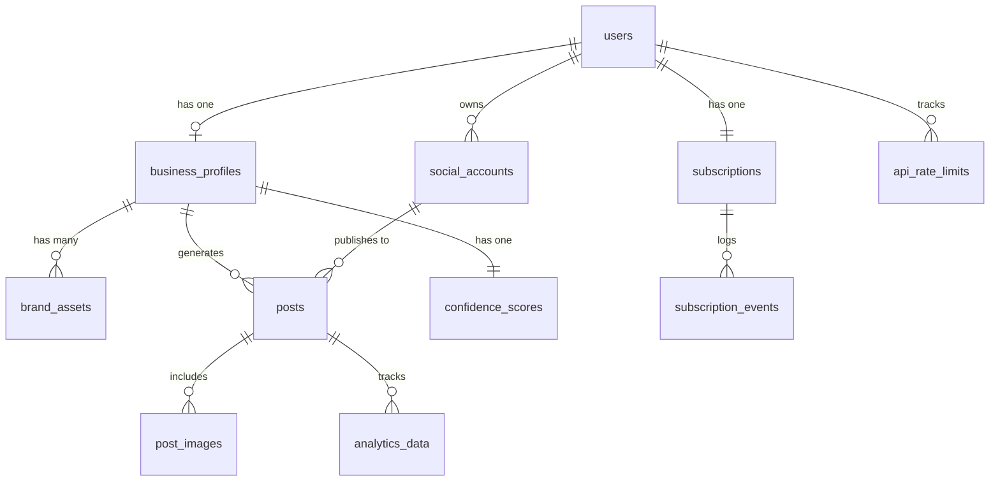

# Data Model: Purple Glow Social

**Date**: October 8, 2025
**Feature**: 001-purple-glow-social
**Phase**: 1 - Design & Contracts

## Overview

This document defines the complete data model for Purple Glow Social, including all entities, relationships, validation rules, and state transitions. The model is designed for implementation in Supabase PostgreSQL with Row Level Security (RLS) policies.

## Entity Relationship Diagram



## Core Entities

### 1. users

**Purpose**: Authentication and user management (managed by Supabase Auth)

**Table Definition**:

```sql
CREATE TABLE users (
  id UUID PRIMARY KEY DEFAULT gen_random_uuid(),
  email TEXT UNIQUE NOT NULL,
  created_at TIMESTAMPTZ NOT NULL DEFAULT NOW(),
  updated_at TIMESTAMPTZ NOT NULL DEFAULT NOW(),
  last_sign_in_at TIMESTAMPTZ,
  email_confirmed_at TIMESTAMPTZ,
  role TEXT NOT NULL DEFAULT 'user' CHECK (role IN ('user', 'admin')),

  -- Metadata
  metadata JSONB DEFAULT '{}'::jsonb
);

-- Indexes
CREATE INDEX idx_users_email ON users(email);
CREATE INDEX idx_users_role ON users(role);

-- RLS Policies
ALTER TABLE users ENABLE ROW LEVEL SECURITY;

CREATE POLICY "Users can view own data"
  ON users FOR SELECT
  USING (auth.uid() = id);

CREATE POLICY "Users can update own data"
  ON users FOR UPDATE
  USING (auth.uid() = id);
```

**Validation Rules**:

- `email`: Valid email format, max 255 characters
- `role`: Enum ['user', 'admin']

**Relationships**:

- Has one `business_profiles`
- Has many `social_accounts`
- Has one `subscriptions`

---

### 2. business_profiles

**Purpose**: Store business information for AI content generation context

**Table Definition**:

```sql
CREATE TABLE business_profiles (
  id UUID PRIMARY KEY DEFAULT gen_random_uuid(),
  user_id UUID NOT NULL REFERENCES users(id) ON DELETE CASCADE,

  -- Basic Information
  business_name TEXT NOT NULL,
  industry TEXT NOT NULL,
  description TEXT NOT NULL,

  -- Target Audience
  target_audience TEXT NOT NULL,
  target_demographics JSONB DEFAULT '[]'::jsonb,

  -- Services & Areas
  services TEXT[] NOT NULL DEFAULT '{}',
  service_areas TEXT[] NOT NULL DEFAULT '{}',

  -- Content Preferences
  preferred_languages TEXT[] NOT NULL DEFAULT ARRAY['English'],
  content_tone TEXT NOT NULL DEFAULT 'professional'
    CHECK (content_tone IN ('professional', 'friendly', 'humorous', 'inspirational')),

  -- Brand Identity
  brand_colors JSONB DEFAULT '[]'::jsonb, -- Array of hex colors
  brand_keywords TEXT[] DEFAULT '{}',

  -- AI Learning State
  confidence_score DECIMAL(5,2) DEFAULT 0.00 CHECK (confidence_score >= 0 AND confidence_score <= 100),
  automation_enabled BOOLEAN DEFAULT FALSE,

  -- Timestamps
  created_at TIMESTAMPTZ NOT NULL DEFAULT NOW(),
  updated_at TIMESTAMPTZ NOT NULL DEFAULT NOW(),

  CONSTRAINT unique_user_business UNIQUE (user_id)
);

-- Indexes
CREATE INDEX idx_business_profiles_user_id ON business_profiles(user_id);
CREATE INDEX idx_business_profiles_confidence_score ON business_profiles(confidence_score);

-- RLS Policies
ALTER TABLE business_profiles ENABLE ROW LEVEL SECURITY;

CREATE POLICY "Users can view own business profile"
  ON business_profiles FOR SELECT
  USING (auth.uid() = user_id);

CREATE POLICY "Users can insert own business profile"
  ON business_profiles FOR INSERT
  WITH CHECK (auth.uid() = user_id);

CREATE POLICY "Users can update own business profile"
  ON business_profiles FOR UPDATE
  USING (auth.uid() = user_id);
```

**Validation Rules**:

- `business_name`: Required, 2-100 characters
- `industry`: Required, 2-50 characters
- `description`: Required, 50-500 characters
- `target_audience`: Required, 20-300 characters
- `services`: At least 1 service, max 20
- `preferred_languages`: At least 1, must be from SA official languages list
- `content_tone`: Enum ['professional', 'friendly', 'humorous', 'inspirational']
- `brand_colors`: Array of valid hex colors (e.g., ['#8B5CF6', '#EC4899'])
- `confidence_score`: 0.00 to 100.00

**State Transitions**:

- `confidence_score`:

  - Starts at 0.00
  - Increases when posts approved without edits
  - Decreases when posts require substantial edits
  - Threshold for automation prompt: 80.00

- `automation_enabled`:
  - `false` → `true`: User opts in after reaching confidence threshold
  - `true` → `false`: User opts out at any time

**Relationships**:

- Belongs to one `users`
- Has many `brand_assets`
- Has many `posts`
- Has one `confidence_scores`

---

### 3. social_accounts

**Purpose**: Store OAuth tokens and metadata for connected social platforms

**Table Definition**:

```sql
CREATE TABLE social_accounts (
  id UUID PRIMARY KEY DEFAULT gen_random_uuid(),
  user_id UUID NOT NULL REFERENCES users(id) ON DELETE CASCADE,

  -- Platform Information
  platform TEXT NOT NULL CHECK (platform IN ('facebook', 'instagram', 'twitter', 'linkedin')),
  platform_user_id TEXT NOT NULL, -- External user ID from platform
  platform_username TEXT,

  -- OAuth Tokens (encrypted at rest)
  access_token TEXT NOT NULL,
  refresh_token TEXT,
  token_expires_at TIMESTAMPTZ,

  -- Account Status
  is_active BOOLEAN DEFAULT TRUE,
  last_sync_at TIMESTAMPTZ,

  -- Platform-Specific Data
  platform_data JSONB DEFAULT '{}'::jsonb, -- Page ID, profile data, etc.

  -- Timestamps
  created_at TIMESTAMPTZ NOT NULL DEFAULT NOW(),
  updated_at TIMESTAMPTZ NOT NULL DEFAULT NOW(),

  CONSTRAINT unique_user_platform_account UNIQUE (user_id, platform, platform_user_id)
);

-- Indexes
CREATE INDEX idx_social_accounts_user_id ON social_accounts(user_id);
CREATE INDEX idx_social_accounts_platform ON social_accounts(platform);
CREATE INDEX idx_social_accounts_token_expires_at ON social_accounts(token_expires_at);

-- RLS Policies
ALTER TABLE social_accounts ENABLE ROW LEVEL SECURITY;

CREATE POLICY "Users can view own social accounts"
  ON social_accounts FOR SELECT
  USING (auth.uid() = user_id);

CREATE POLICY "Users can insert own social accounts"
  ON social_accounts FOR INSERT
  WITH CHECK (auth.uid() = user_id);

CREATE POLICY "Users can update own social accounts"
  ON social_accounts FOR UPDATE
  USING (auth.uid() = user_id);

CREATE POLICY "Users can delete own social accounts"
  ON social_accounts FOR DELETE
  USING (auth.uid() = user_id);
```

**Validation Rules**:

- `platform`: Enum ['facebook', 'instagram', 'twitter', 'linkedin']
- `platform_user_id`: Required, max 255 characters
- `access_token`: Required (encrypted)
- `token_expires_at`: Must be future timestamp or null

**State Transitions**:

- `is_active`:
  - `true` → `false`: Token expires, revoked, or user disconnects
  - `false` → `true`: User re-authenticates

**Relationships**:

- Belongs to one `users`
- Has many `posts` (as target platform)

---

### 4. subscriptions

**Purpose**: Manage subscription tiers, billing, and usage limits

**Table Definition**:

```sql
CREATE TABLE subscriptions (
  id UUID PRIMARY KEY DEFAULT gen_random_uuid(),
  user_id UUID NOT NULL REFERENCES users(id) ON DELETE CASCADE,

  -- Subscription Details
  tier TEXT NOT NULL DEFAULT 'trial'
    CHECK (tier IN ('trial', 'starter', 'growth', 'enterprise')),
  status TEXT NOT NULL DEFAULT 'active'
    CHECK (status IN ('active', 'past_due', 'canceled', 'paused')),

  -- Billing
  paystack_customer_id TEXT,
  paystack_subscription_id TEXT,
  amount_zar DECIMAL(10,2) DEFAULT 0.00,

  -- Limits & Usage
  monthly_post_limit INTEGER NOT NULL DEFAULT 50,
  posts_used_this_cycle INTEGER DEFAULT 0,

  -- Billing Cycle
  current_period_start TIMESTAMPTZ NOT NULL DEFAULT NOW(),
  current_period_end TIMESTAMPTZ NOT NULL DEFAULT NOW() + INTERVAL '30 days',
  trial_ends_at TIMESTAMPTZ, -- For 14-day trial

  -- Timestamps
  created_at TIMESTAMPTZ NOT NULL DEFAULT NOW(),
  updated_at TIMESTAMPTZ NOT NULL DEFAULT NOW(),
  canceled_at TIMESTAMPTZ,

  CONSTRAINT unique_user_subscription UNIQUE (user_id)
);

-- Indexes
CREATE INDEX idx_subscriptions_user_id ON subscriptions(user_id);
CREATE INDEX idx_subscriptions_status ON subscriptions(status);
CREATE INDEX idx_subscriptions_current_period_end ON subscriptions(current_period_end);
CREATE INDEX idx_subscriptions_trial_ends_at ON subscriptions(trial_ends_at);

-- RLS Policies
ALTER TABLE subscriptions ENABLE ROW LEVEL SECURITY;

CREATE POLICY "Users can view own subscription"
  ON subscriptions FOR SELECT
  USING (auth.uid() = user_id);

CREATE POLICY "Users can update own subscription"
  ON subscriptions FOR UPDATE
  USING (auth.uid() = user_id);
```

**Validation Rules**:

- `tier`: Enum ['trial', 'starter', 'growth', 'enterprise']
- `status`: Enum ['active', 'past_due', 'canceled', 'paused']
- `monthly_post_limit`:
  - trial: 50
  - starter: 10
  - growth: 50
  - enterprise: -1 (unlimited, represented as -1)
- `posts_used_this_cycle`: >= 0, <= monthly_post_limit (unless enterprise)
- `amount_zar`: >= 0

**State Transitions**:

- `status`:

  - `active` → `past_due`: Payment failed
  - `active` → `canceled`: User cancels
  - `past_due` → `active`: Payment resolved
  - `past_due` → `canceled`: Grace period expired
  - `canceled` → `active`: User reactivates

- `posts_used_this_cycle`:
  - Resets to 0 at `current_period_end`
  - Increments on successful post generation

**Relationships**:

- Belongs to one `users`
- Has many `subscription_events`

---

### 5. posts

**Purpose**: Store generated content with lifecycle management

**Table Definition**:

```sql
CREATE TABLE posts (
  id UUID PRIMARY KEY DEFAULT gen_random_uuid(),
  user_id UUID NOT NULL REFERENCES users(id) ON DELETE CASCADE,
  business_profile_id UUID NOT NULL REFERENCES business_profiles(id) ON DELETE CASCADE,

  -- Content
  content_text TEXT NOT NULL,
  content_language TEXT NOT NULL DEFAULT 'English',

  -- AI Generation Metadata
  generated_by TEXT DEFAULT 'gemini-1.5-pro',
  generation_prompt TEXT,
  original_text TEXT, -- Before user edits
  edit_count INTEGER DEFAULT 0,

  -- Lifecycle State
  status TEXT NOT NULL DEFAULT 'draft'
    CHECK (status IN ('draft', 'pending_approval', 'approved', 'scheduled', 'published', 'failed', 'archived')),

  -- Scheduling
  scheduled_for TIMESTAMPTZ,
  published_at TIMESTAMPTZ,

  -- Publishing Details
  target_platforms TEXT[] DEFAULT '{}', -- ['facebook', 'instagram']
  published_to JSONB DEFAULT '{}'::jsonb, -- {"facebook": {"post_id": "123", "url": "..."}}

  -- Error Handling
  failure_reason TEXT,
  retry_count INTEGER DEFAULT 0,

  -- Timestamps
  created_at TIMESTAMPTZ NOT NULL DEFAULT NOW(),
  updated_at TIMESTAMPTZ NOT NULL DEFAULT NOW(),

  -- Constraints
  CHECK (
    (status = 'scheduled' AND scheduled_for IS NOT NULL) OR
    (status != 'scheduled')
  )
);

-- Indexes
CREATE INDEX idx_posts_user_id ON posts(user_id);
CREATE INDEX idx_posts_business_profile_id ON posts(business_profile_id);
CREATE INDEX idx_posts_status ON posts(status);
CREATE INDEX idx_posts_scheduled_for ON posts(scheduled_for) WHERE status = 'scheduled';
CREATE INDEX idx_posts_published_at ON posts(published_at);

-- RLS Policies
ALTER TABLE posts ENABLE ROW LEVEL SECURITY;

CREATE POLICY "Users can view own posts"
  ON posts FOR SELECT
  USING (auth.uid() = user_id);

CREATE POLICY "Users can insert own posts"
  ON posts FOR INSERT
  WITH CHECK (auth.uid() = user_id);

CREATE POLICY "Users can update own posts"
  ON posts FOR UPDATE
  USING (auth.uid() = user_id);

CREATE POLICY "Users can delete own posts"
  ON posts FOR DELETE
  USING (auth.uid() = user_id);
```

**Validation Rules**:

- `content_text`: Required, 10-5000 characters (varies by platform)
- `content_language`: Must be from SA official languages list
- `status`: Enum ['draft', 'pending_approval', 'approved', 'scheduled', 'published', 'failed', 'archived']
- `target_platforms`: At least 1 platform selected
- `scheduled_for`: Must be future timestamp if status is 'scheduled'
- `retry_count`: 0-3 (max 3 retry attempts)

**State Transitions**:

```
draft → pending_approval → approved → scheduled → published
                         ↓
                      archived

Any state → failed (if error occurs)
failed → scheduled (if retry)
```

**Phase 1 (Manual Approval)**:

1. AI generates post → `draft`
2. User reviews → `pending_approval`
3. User approves/edits → `approved`
4. System schedules → `scheduled`
5. Cron job publishes → `published`

**Phase 2 (Autonomous)**:

1. AI generates post → `approved` (skip manual review)
2. System schedules → `scheduled`
3. Cron job publishes → `published`

**Relationships**:

- Belongs to one `users`
- Belongs to one `business_profiles`
- Has many `post_images`
- Has many `analytics_data`

---

### 6. post_images

**Purpose**: Store AI-generated or uploaded images for posts

**Table Definition**:

```sql
CREATE TABLE post_images (
  id UUID PRIMARY KEY DEFAULT gen_random_uuid(),
  post_id UUID NOT NULL REFERENCES posts(id) ON DELETE CASCADE,
  user_id UUID NOT NULL REFERENCES users(id) ON DELETE CASCADE,

  -- Image Storage
  storage_path TEXT NOT NULL, -- Supabase Storage path
  public_url TEXT NOT NULL,

  -- Image Metadata
  width INTEGER,
  height INTEGER,
  file_size INTEGER, -- bytes
  mime_type TEXT DEFAULT 'image/jpeg',

  -- AI Generation
  generated_by TEXT, -- 'gemini-2.5-flash' or null if uploaded
  generation_prompt TEXT,

  -- Timestamps
  created_at TIMESTAMPTZ NOT NULL DEFAULT NOW()
);

-- Indexes
CREATE INDEX idx_post_images_post_id ON post_images(post_id);
CREATE INDEX idx_post_images_user_id ON post_images(user_id);

-- RLS Policies
ALTER TABLE post_images ENABLE ROW LEVEL SECURITY;

CREATE POLICY "Users can view own post images"
  ON post_images FOR SELECT
  USING (auth.uid() = user_id);

CREATE POLICY "Users can insert own post images"
  ON post_images FOR INSERT
  WITH CHECK (auth.uid() = user_id);

CREATE POLICY "Users can delete own post images"
  ON post_images FOR DELETE
  USING (auth.uid() = user_id);
```

**Validation Rules**:

- `storage_path`: Required, valid Supabase Storage path
- `public_url`: Required, valid URL
- `mime_type`: ['image/jpeg', 'image/png', 'image/webp']
- `file_size`: Max 10MB (10485760 bytes)

**Relationships**:

- Belongs to one `posts`
- Belongs to one `users`

---

### 7. brand_assets

**Purpose**: Store logos and brand images uploaded by users

**Table Definition**:

```sql
CREATE TABLE brand_assets (
  id UUID PRIMARY KEY DEFAULT gen_random_uuid(),
  business_profile_id UUID NOT NULL REFERENCES business_profiles(id) ON DELETE CASCADE,
  user_id UUID NOT NULL REFERENCES users(id) ON DELETE CASCADE,

  -- Asset Details
  asset_type TEXT NOT NULL CHECK (asset_type IN ('logo', 'banner', 'pattern', 'other')),
  storage_path TEXT NOT NULL,
  public_url TEXT NOT NULL,

  -- Metadata
  file_name TEXT NOT NULL,
  file_size INTEGER,
  mime_type TEXT,

  -- Usage
  is_primary BOOLEAN DEFAULT FALSE, -- Primary logo

  -- Timestamps
  created_at TIMESTAMPTZ NOT NULL DEFAULT NOW(),
  updated_at TIMESTAMPTZ NOT NULL DEFAULT NOW()
);

-- Indexes
CREATE INDEX idx_brand_assets_business_profile_id ON brand_assets(business_profile_id);
CREATE INDEX idx_brand_assets_user_id ON brand_assets(user_id);
CREATE INDEX idx_brand_assets_asset_type ON brand_assets(asset_type);

-- RLS Policies
ALTER TABLE brand_assets ENABLE ROW LEVEL SECURITY;

CREATE POLICY "Users can view own brand assets"
  ON brand_assets FOR SELECT
  USING (auth.uid() = user_id);

CREATE POLICY "Users can insert own brand assets"
  ON brand_assets FOR INSERT
  WITH CHECK (auth.uid() = user_id);

CREATE POLICY "Users can update own brand assets"
  ON brand_assets FOR UPDATE
  USING (auth.uid() = user_id);

CREATE POLICY "Users can delete own brand assets"
  ON brand_assets FOR DELETE
  USING (auth.uid() = user_id);
```

**Validation Rules**:

- `asset_type`: Enum ['logo', 'banner', 'pattern', 'other']
- `file_size`: Max 10MB
- `mime_type`: ['image/jpeg', 'image/png', 'image/svg+xml']
- Only one `is_primary` logo per business profile

**Relationships**:

- Belongs to one `business_profiles`
- Belongs to one `users`

---

### 8. analytics_data

**Purpose**: Store engagement metrics from social platforms

**Table Definition**:

```sql
CREATE TABLE analytics_data (
  id UUID PRIMARY KEY DEFAULT gen_random_uuid(),
  post_id UUID NOT NULL REFERENCES posts(id) ON DELETE CASCADE,
  user_id UUID NOT NULL REFERENCES users(id) ON DELETE CASCADE,

  -- Platform
  platform TEXT NOT NULL CHECK (platform IN ('facebook', 'instagram', 'twitter', 'linkedin')),
  platform_post_id TEXT NOT NULL,

  -- Engagement Metrics
  likes_count INTEGER DEFAULT 0,
  comments_count INTEGER DEFAULT 0,
  shares_count INTEGER DEFAULT 0,
  impressions_count INTEGER DEFAULT 0,
  reach_count INTEGER DEFAULT 0,
  clicks_count INTEGER DEFAULT 0,

  -- Engagement Rate Calculation
  engagement_rate DECIMAL(5,2) DEFAULT 0.00, -- Calculated: (likes + comments + shares) / reach * 100

  -- Sync Information
  synced_at TIMESTAMPTZ NOT NULL DEFAULT NOW(),

  -- Timestamps
  created_at TIMESTAMPTZ NOT NULL DEFAULT NOW(),
  updated_at TIMESTAMPTZ NOT NULL DEFAULT NOW(),

  CONSTRAINT unique_post_platform UNIQUE (post_id, platform)
);

-- Indexes
CREATE INDEX idx_analytics_data_post_id ON analytics_data(post_id);
CREATE INDEX idx_analytics_data_user_id ON analytics_data(user_id);
CREATE INDEX idx_analytics_data_platform ON analytics_data(platform);
CREATE INDEX idx_analytics_data_synced_at ON analytics_data(synced_at);

-- RLS Policies
ALTER TABLE analytics_data ENABLE ROW LEVEL SECURITY;

CREATE POLICY "Users can view own analytics data"
  ON analytics_data FOR SELECT
  USING (auth.uid() = user_id);
```

**Validation Rules**:

- All count fields: >= 0
- `engagement_rate`: 0.00 to 100.00
- `platform_post_id`: Required, platform-specific format

**Relationships**:

- Belongs to one `posts`
- Belongs to one `users`

---

### 9. confidence_scores

**Purpose**: Track AI learning progress per business for automation decisions

**Table Definition**:

```sql
CREATE TABLE confidence_scores (
  id UUID PRIMARY KEY DEFAULT gen_random_uuid(),
  business_profile_id UUID NOT NULL REFERENCES business_profiles(id) ON DELETE CASCADE UNIQUE,
  user_id UUID NOT NULL REFERENCES users(id) ON DELETE CASCADE,

  -- Scoring Metrics
  total_posts_generated INTEGER DEFAULT 0,
  posts_approved_no_edit INTEGER DEFAULT 0,
  posts_with_minor_edits INTEGER DEFAULT 0,
  posts_with_major_edits INTEGER DEFAULT 0,
  posts_rejected INTEGER DEFAULT 0,

  -- Calculated Score
  confidence_score DECIMAL(5,2) DEFAULT 0.00 CHECK (confidence_score >= 0 AND confidence_score <= 100),

  -- Thresholds
  automation_threshold DECIMAL(5,2) DEFAULT 80.00,
  automation_suggested_at TIMESTAMPTZ,
  automation_accepted_at TIMESTAMPTZ,

  -- Timestamps
  created_at TIMESTAMPTZ NOT NULL DEFAULT NOW(),
  updated_at TIMESTAMPTZ NOT NULL DEFAULT NOW()
);

-- Indexes
CREATE INDEX idx_confidence_scores_business_profile_id ON confidence_scores(business_profile_id);
CREATE INDEX idx_confidence_scores_user_id ON confidence_scores(user_id);

-- RLS Policies
ALTER TABLE confidence_scores ENABLE ROW LEVEL SECURITY;

CREATE POLICY "Users can view own confidence scores"
  ON confidence_scores FOR SELECT
  USING (auth.uid() = user_id);
```

**Validation Rules**:

- All count fields: >= 0
- `confidence_score`: Calculated as:

  ```
  score = (
    (posts_approved_no_edit * 10) +
    (posts_with_minor_edits * 5) -
    (posts_with_major_edits * 3) -
    (posts_rejected * 5)
  ) / total_posts_generated

  normalized_score = MIN(100, MAX(0, score))
  ```

**State Transitions**:

- `automation_suggested_at`: Set when `confidence_score >= automation_threshold`
- `automation_accepted_at`: Set when user enables automation

**Relationships**:

- Belongs to one `business_profiles`
- Belongs to one `users`

---

### 10. api_rate_limits

**Purpose**: Track API usage per user per platform to prevent rate limit violations

**Table Definition**:

```sql
CREATE TABLE api_rate_limits (
  id UUID PRIMARY KEY DEFAULT gen_random_uuid(),
  user_id UUID NOT NULL REFERENCES users(id) ON DELETE CASCADE,

  -- Platform & Type
  platform TEXT NOT NULL CHECK (platform IN ('facebook', 'instagram', 'twitter', 'linkedin', 'gemini')),
  limit_type TEXT NOT NULL, -- 'posts', 'api_calls', 'tokens'

  -- Rate Limit Window
  window_start TIMESTAMPTZ NOT NULL DEFAULT NOW(),
  window_duration INTERVAL NOT NULL, -- '1 hour', '1 day', etc.

  -- Usage Tracking
  calls_made INTEGER DEFAULT 0,
  calls_limit INTEGER NOT NULL,

  -- Reset Information
  resets_at TIMESTAMPTZ NOT NULL,

  -- Timestamps
  created_at TIMESTAMPTZ NOT NULL DEFAULT NOW(),
  updated_at TIMESTAMPTZ NOT NULL DEFAULT NOW(),

  CONSTRAINT unique_user_platform_limit UNIQUE (user_id, platform, limit_type, window_start)
);

-- Indexes
CREATE INDEX idx_api_rate_limits_user_id ON api_rate_limits(user_id);
CREATE INDEX idx_api_rate_limits_platform ON api_rate_limits(platform);
CREATE INDEX idx_api_rate_limits_resets_at ON api_rate_limits(resets_at);

-- RLS Policies
ALTER TABLE api_rate_limits ENABLE ROW LEVEL SECURITY;

CREATE POLICY "Users can view own rate limits"
  ON api_rate_limits FOR SELECT
  USING (auth.uid() = user_id);
```

**Validation Rules**:

- `calls_made`: >= 0, <= calls_limit
- `resets_at`: Must be future timestamp
- Window resets automatically when NOW() > resets_at

**Relationships**:

- Belongs to one `users`

---

### 11. subscription_events

**Purpose**: Audit log for subscription changes and billing events

**Table Definition**:

```sql
CREATE TABLE subscription_events (
  id UUID PRIMARY KEY DEFAULT gen_random_uuid(),
  subscription_id UUID NOT NULL REFERENCES subscriptions(id) ON DELETE CASCADE,
  user_id UUID NOT NULL REFERENCES users(id) ON DELETE CASCADE,

  -- Event Details
  event_type TEXT NOT NULL CHECK (event_type IN (
    'created', 'upgraded', 'downgraded', 'canceled', 'reactivated',
    'payment_succeeded', 'payment_failed', 'trial_started', 'trial_ended'
  )),

  -- Event Data
  from_tier TEXT,
  to_tier TEXT,
  amount_zar DECIMAL(10,2),

  -- Paystack Reference
  paystack_event_id TEXT,

  -- Metadata
  metadata JSONB DEFAULT '{}'::jsonb,

  -- Timestamp
  created_at TIMESTAMPTZ NOT NULL DEFAULT NOW()
);

-- Indexes
CREATE INDEX idx_subscription_events_subscription_id ON subscription_events(subscription_id);
CREATE INDEX idx_subscription_events_user_id ON subscription_events(user_id);
CREATE INDEX idx_subscription_events_event_type ON subscription_events(event_type);
CREATE INDEX idx_subscription_events_created_at ON subscription_events(created_at);

-- RLS Policies
ALTER TABLE subscription_events ENABLE ROW LEVEL SECURITY;

CREATE POLICY "Users can view own subscription events"
  ON subscription_events FOR SELECT
  USING (auth.uid() = user_id);
```

**Validation Rules**:

- `event_type`: One of defined enum values
- `amount_zar`: >= 0
- Immutable (insert only, no updates or deletes)

**Relationships**:

- Belongs to one `subscriptions`
- Belongs to one `users`

---

## Supporting Tables (Admin/System)

### 12. admin_lead_insights

**Purpose**: Store scraped social media insights for potential leads (Admin tool)

```sql
CREATE TABLE admin_lead_insights (
  id UUID PRIMARY KEY DEFAULT gen_random_uuid(),

  -- Lead Information
  business_name TEXT NOT NULL,
  industry TEXT,
  social_platform TEXT NOT NULL,
  social_handle TEXT NOT NULL,

  -- Insights Data
  follower_count INTEGER,
  post_frequency TEXT, -- 'daily', 'weekly', 'sporadic'
  engagement_quality TEXT, -- 'high', 'medium', 'low'
  content_quality_score DECIMAL(3,2),

  -- Opportunity Assessment
  opportunity_score DECIMAL(5,2), -- 0-100
  recommended_tier TEXT,
  notes TEXT,

  -- Contact Status
  contact_status TEXT DEFAULT 'new' CHECK (contact_status IN ('new', 'contacted', 'qualified', 'converted', 'not_interested')),
  contacted_at TIMESTAMPTZ,

  -- Timestamps
  scraped_at TIMESTAMPTZ NOT NULL DEFAULT NOW(),
  created_at TIMESTAMPTZ NOT NULL DEFAULT NOW(),
  updated_at TIMESTAMPTZ NOT NULL DEFAULT NOW()
);

-- Indexes
CREATE INDEX idx_admin_lead_insights_opportunity_score ON admin_lead_insights(opportunity_score DESC);
CREATE INDEX idx_admin_lead_insights_contact_status ON admin_lead_insights(contact_status);
CREATE INDEX idx_admin_lead_insights_scraped_at ON admin_lead_insights(scraped_at);

-- RLS Policies
ALTER TABLE admin_lead_insights ENABLE ROW LEVEL SECURITY;

CREATE POLICY "Only admins can access lead insights"
  ON admin_lead_insights FOR ALL
  USING (
    EXISTS (
      SELECT 1 FROM users WHERE id = auth.uid() AND role = 'admin'
    )
  );
```

---

## Database Functions & Triggers

### Update Timestamp Trigger

```sql
CREATE OR REPLACE FUNCTION update_updated_at_column()
RETURNS TRIGGER AS $$
BEGIN
  NEW.updated_at = NOW();
  RETURN NEW;
END;
$$ LANGUAGE plpgsql;

-- Apply to all tables with updated_at
CREATE TRIGGER update_users_updated_at BEFORE UPDATE ON users
  FOR EACH ROW EXECUTE FUNCTION update_updated_at_column();

CREATE TRIGGER update_business_profiles_updated_at BEFORE UPDATE ON business_profiles
  FOR EACH ROW EXECUTE FUNCTION update_updated_at_column();

CREATE TRIGGER update_social_accounts_updated_at BEFORE UPDATE ON social_accounts
  FOR EACH ROW EXECUTE FUNCTION update_updated_at_column();

CREATE TRIGGER update_subscriptions_updated_at BEFORE UPDATE ON subscriptions
  FOR EACH ROW EXECUTE FUNCTION update_updated_at_column();

CREATE TRIGGER update_posts_updated_at BEFORE UPDATE ON posts
  FOR EACH ROW EXECUTE FUNCTION update_updated_at_column();

CREATE TRIGGER update_brand_assets_updated_at BEFORE UPDATE ON brand_assets
  FOR EACH ROW EXECUTE FUNCTION update_updated_at_column();

CREATE TRIGGER update_analytics_data_updated_at BEFORE UPDATE ON analytics_data
  FOR EACH ROW EXECUTE FUNCTION update_updated_at_column();

CREATE TRIGGER update_confidence_scores_updated_at BEFORE UPDATE ON confidence_scores
  FOR EACH ROW EXECUTE FUNCTION update_updated_at_column();

CREATE TRIGGER update_api_rate_limits_updated_at BEFORE UPDATE ON api_rate_limits
  FOR EACH ROW EXECUTE FUNCTION update_updated_at_column();

CREATE TRIGGER update_admin_lead_insights_updated_at BEFORE UPDATE ON admin_lead_insights
  FOR EACH ROW EXECUTE FUNCTION update_updated_at_column();
```

### Calculate Engagement Rate

```sql
CREATE OR REPLACE FUNCTION calculate_engagement_rate()
RETURNS TRIGGER AS $$
BEGIN
  IF NEW.reach_count > 0 THEN
    NEW.engagement_rate := ROUND(
      ((NEW.likes_count + NEW.comments_count + NEW.shares_count)::DECIMAL / NEW.reach_count * 100),
      2
    );
  ELSE
    NEW.engagement_rate := 0.00;
  END IF;
  RETURN NEW;
END;
$$ LANGUAGE plpgsql;

CREATE TRIGGER calculate_analytics_engagement_rate
  BEFORE INSERT OR UPDATE ON analytics_data
  FOR EACH ROW EXECUTE FUNCTION calculate_engagement_rate();
```

### Update Confidence Score

```sql
CREATE OR REPLACE FUNCTION update_confidence_score()
RETURNS TRIGGER AS $$
DECLARE
  v_score DECIMAL(5,2);
BEGIN
  IF NEW.total_posts_generated > 0 THEN
    v_score := (
      (NEW.posts_approved_no_edit * 10.0) +
      (NEW.posts_with_minor_edits * 5.0) -
      (NEW.posts_with_major_edits * 3.0) -
      (NEW.posts_rejected * 5.0)
    ) / NEW.total_posts_generated;

    NEW.confidence_score := GREATEST(0.00, LEAST(100.00, v_score));

    -- Trigger automation suggestion
    IF NEW.confidence_score >= NEW.automation_threshold AND NEW.automation_suggested_at IS NULL THEN
      NEW.automation_suggested_at := NOW();
    END IF;
  ELSE
    NEW.confidence_score := 0.00;
  END IF;

  RETURN NEW;
END;
$$ LANGUAGE plpgsql;

CREATE TRIGGER update_confidence_scores_score
  BEFORE UPDATE ON confidence_scores
  FOR EACH ROW EXECUTE FUNCTION update_confidence_score();
```

### Reset Subscription Usage on New Cycle

```sql
CREATE OR REPLACE FUNCTION reset_subscription_usage()
RETURNS void AS $$
BEGIN
  UPDATE subscriptions
  SET
    posts_used_this_cycle = 0,
    current_period_start = current_period_end,
    current_period_end = current_period_end + INTERVAL '30 days'
  WHERE current_period_end <= NOW();
END;
$$ LANGUAGE plpgsql;

-- Schedule with pg_cron (runs daily)
SELECT cron.schedule(
  'reset-subscription-usage',
  '0 0 * * *', -- Daily at midnight
  $$SELECT reset_subscription_usage();$$
);
```

---

## Data Validation Summary

| Entity            | Critical Validations                       | Zod Schema Required |
| ----------------- | ------------------------------------------ | ------------------- |
| users             | Email format, role enum                    | ✅ Yes              |
| business_profiles | Language list, tone enum, score range      | ✅ Yes              |
| social_accounts   | Platform enum, token expiry                | ✅ Yes              |
| subscriptions     | Tier limits, status transitions            | ✅ Yes              |
| posts             | Content length, status flow, platform list | ✅ Yes              |
| post_images       | File size, mime type, dimensions           | ✅ Yes              |
| brand_assets      | File size, mime type, asset type           | ✅ Yes              |
| analytics_data    | Non-negative counts, rate calculation      | ✅ Yes              |
| confidence_scores | Score calculation, threshold logic         | ✅ Yes              |
| api_rate_limits   | Limit enforcement, reset timing            | ✅ Yes              |

---

## Next Steps

1. Create Zod schemas in `lib/validations/`
2. Generate TypeScript types from schemas
3. Create Supabase migrations in `supabase/migrations/`
4. Implement RLS policies
5. Create API endpoints following OpenAPI contract
6. Implement seed data for development

---

**Status**: ✅ Complete - Ready for API contract generation
