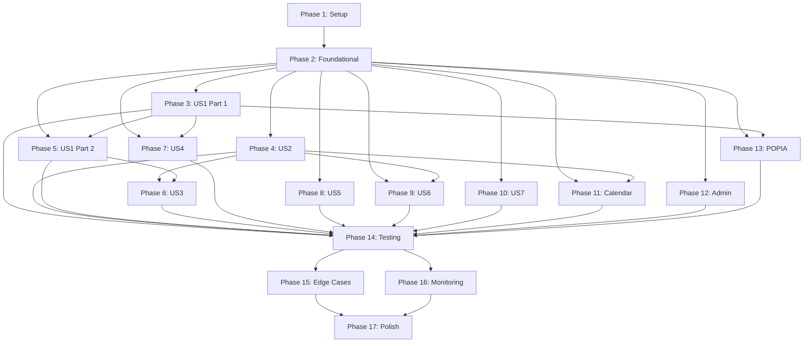

# Tasks: Purple Glow Social - AI Social Media Manager

**Input**: Design documents from `/specs/001-purple-glow-social/`
**Branch**: `001-purple-glow-social`
**Date Generated**: October 8, 2025 (Regenerated with full coverage)

**Prerequisites**:

- ✅ plan.md (tech stack, structure)
- ✅ spec.md (user stories with priorities)
- ✅ research.md (technical decisions)
- ✅ data-model.md (entities, relationships)
- ✅ contracts/openapi.yaml (API endpoints)
- ✅ quickstart.md (setup guide)

**Tests**: ✅ INCLUDED - Comprehensive test tasks per Constitution Article V (unit, integration, E2E, contract tests)

**Organization**: Tasks are grouped by user story to enable independent implementation and testing. All 7 user stories (US1-US7) have complete task coverage.

## Format: `[ID] [P?] [Story] Description`

- **[P]**: Can run in parallel (different files, no dependencies)
- **[Story]**: Which user story this task belongs to (e.g., US1, US2, US3)
- All paths assume Next.js 15 App Router structure per plan.md

---

## Phase 1: Setup (Shared Infrastructure)

**Purpose**: Project initialization and basic structure needed by all features

- [ ] T001 Initialize Next.js 15 project with TypeScript strict mode and App Router configuration
- [ ] T002 [P] Install and configure Tailwind CSS with Purple Glow custom theme in `tailwind.config.ts`
- [ ] T003 [P] Install and setup Shadcn UI components in `components/ui/`
- [ ] T004 [P] Install core dependencies: Supabase client, Zod, TanStack Query, CopilotKit
- [ ] T005 [P] Configure ESLint, Prettier, and TypeScript strict mode settings
- [ ] T006 Create project folder structure per plan.md: `app/`, `components/`, `lib/`, `supabase/`
- [ ] T007 Setup environment variable configuration and `.env.local` template per quickstart.md
- [ ] T008 [P] Initialize Git repository and create `.gitignore` with sensitive files excluded
- [ ] T009 [P] Create README.md with project overview and links to quickstart.md

---

## Phase 2: Foundational (Blocking Prerequisites)

**Purpose**: Core infrastructure that MUST be complete before ANY user story can be implemented

**⚠️ CRITICAL**: No user story work can begin until this phase is complete

### Database & Backend Infrastructure

- [ ] T010 Setup Supabase project and configure connection in `lib/supabase/client.ts` and `lib/supabase/server.ts`
- [ ] T011 Create database migration for `users` table in `supabase/migrations/001_create_users.sql`
- [ ] T012 [P] Create database migration for `business_profiles` table with confidence score tracking in `supabase/migrations/002_create_business_profiles.sql`
- [ ] T013 [P] Create database migration for `social_accounts` table with OAuth token storage in `supabase/migrations/003_create_social_accounts.sql`
- [ ] T014 [P] Create database migration for `subscriptions` table with tier limits in `supabase/migrations/004_create_subscriptions.sql`
- [ ] T015 [P] Create database migration for `posts` table with lifecycle states in `supabase/migrations/005_create_posts.sql`
- [ ] T016 [P] Create database migration for `post_images` table in `supabase/migrations/006_create_post_images.sql`
- [ ] T017 [P] Create database migration for `brand_assets` table in `supabase/migrations/007_create_brand_assets.sql`
- [ ] T018 [P] Create database migration for `analytics_data` table in `supabase/migrations/008_create_analytics_data.sql`
- [ ] T019 [P] Create database migration for `confidence_scores` table in `supabase/migrations/009_create_confidence_scores.sql`
- [ ] T020 [P] Create database migration for `api_rate_limits` table in `supabase/migrations/010_create_api_rate_limits.sql`
- [ ] T021 [P] Create database migration for `subscription_events` audit table in `supabase/migrations/011_create_subscription_events.sql`
- [ ] T022 [P] Create database migration for `admin_lead_insights` table in `supabase/migrations/012_create_admin_lead_insights.sql`
- [ ] T023 Create database functions and triggers: update_updated_at, calculate_engagement_rate, update_confidence_score in `supabase/migrations/013_create_functions_triggers.sql`
- [ ] T024 Implement Row Level Security (RLS) policies for all tables per data-model.md in `supabase/migrations/014_create_rls_policies.sql`
- [ ] T025 Create pg_cron scheduled jobs: post publishing, token refresh, analytics sync, confidence calculation in `supabase/migrations/015_setup_cron_jobs.sql`
- [ ] T026 Run all migrations and verify database schema matches data-model.md

### Core Validations & Types

- [ ] T027 [P] Create Zod schema for User model in `lib/validations/user.ts`
- [ ] T028 [P] Create Zod schema for BusinessProfile model in `lib/validations/business.ts`
- [ ] T029 [P] Create Zod schema for SocialAccount model in `lib/validations/social.ts`
- [ ] T030 [P] Create Zod schema for Subscription model in `lib/validations/subscription.ts`
- [ ] T031 [P] Create Zod schema for Post model in `lib/validations/content.ts`
- [ ] T032 [P] Create TypeScript types from Zod schemas in `lib/types/index.ts`
- [ ] T033 [P] Create constants file for enums: languages, platforms, tiers, tones in `lib/constants/index.ts`

### Authentication Framework

- [ ] T034 Configure Supabase Auth with email/password and OAuth providers in Supabase dashboard
- [ ] T035 Create auth middleware in `lib/supabase/middleware.ts` for protected routes
- [ ] T036 [P] Implement auth helper functions: getUser, getSession in `lib/supabase/auth-helpers.ts`
- [ ] T037 Create Root Layout with auth context provider in `app/layout.tsx`
- [ ] T038 [P] Create global CSS with Purple Glow theme variables in `app/globals.css`

### API Infrastructure

- [ ] T039 Create API error handling utilities in `lib/utils/api-errors.ts`
- [ ] T040 [P] Create API response formatter utilities in `lib/utils/api-response.ts`
- [ ] T041 [P] Create rate limiting middleware in `lib/utils/rate-limit.ts`
- [ ] T042 Setup TanStack Query provider and configuration in `lib/providers/query-provider.tsx`

**Checkpoint**: ✅ Foundation ready - user story implementation can now begin in parallel

---

## Phase 3: User Story 1 - SMB Owner Onboarding and Business Profile Creation (Priority: P1) 🎯 MVP

**Goal**: Enable SMB owners to quickly onboard and set up their business profile so the AI can generate relevant content

**Independent Test**: Complete onboarding flow, verify business profile created with all information stored correctly in database

### Models & Services for US1

- [x] T043 [P] [US1] Implement business profile service in `lib/services/business-profile.ts` with create/update operations
- [x] T044 [P] [US1] Implement brand assets upload service with Supabase Storage integration in `lib/services/brand-assets.ts`

### API Endpoints for US1

- [x] T045 [P] [US1] Create POST /api/auth/signup endpoint in `app/api/auth/signup/route.ts`
- [x] T046 [P] [US1] Create POST /api/auth/login endpoint in `app/api/auth/login/route.ts`
- [x] T047 [P] [US1] Create POST /api/business-profiles endpoint in `app/api/business-profiles/route.ts`
- [x] T048 [P] [US1] Create PATCH /api/business-profiles endpoint in same file
- [x] T049 [P] [US1] Create POST /api/brand-assets endpoint with file upload handling in `app/api/brand-assets/route.ts`
- [x] T050 [P] [US1] Create DELETE /api/brand-assets/[assetId] endpoint in `app/api/brand-assets/[assetId]/route.ts`

### UI Components for US1

- [x] T051 [P] [US1] Create signup page in `app/(auth)/signup/page.tsx`
- [x] T052 [P] [US1] Create login page in `app/(auth)/login/page.tsx`
- [x] T053 [P] [US1] Create OAuth callback handler in `app/(auth)/oauth-callback/page.tsx`
- [x] T054 [US1] Create onboarding wizard layout in `app/(dashboard)/onboarding/layout.tsx`
- [x] T055 [US1] Create Step 1: Welcome screen in `app/(dashboard)/onboarding/page.tsx`
- [x] T056 [US1] Create Step 2: Business information form in `app/(dashboard)/onboarding/business-info/page.tsx`
- [x] T057 [US1] Create Step 3: Brand identity upload screen in `app/(dashboard)/onboarding/brand-identity/page.tsx`
- [x] T058 [US1] Create Step 4: Social media connection screen (stub for US1) in `app/(dashboard)/onboarding/social-connect/page.tsx`
- [x] T059 [P] [US1] Create reusable form components: BusinessInfoForm in `components/onboarding/business-info-form.tsx`
- [x] T060 [P] [US1] Create reusable FileUpload component with drag-drop in `components/ui/file-upload.tsx`
- [x] T061 [P] [US1] Create progress stepper component for onboarding in `components/onboarding/progress-stepper.tsx`

### Integration for US1

- [x] T062 [US1] Wire up onboarding flow: signup → business profile → brand upload → redirect to dashboard
- [x] T063 [US1] Add validation and error handling throughout onboarding flow
- [x] T064 [US1] Add loading states and progress indicators for all async operations
- [x] T065 [US1] Implement form persistence (save draft if user leaves)

**Checkpoint**: ✅ User Story 1 complete - users can onboard and create business profile. Verify with manual test of full flow.

---

## Phase 4: User Story 2 - AI Content Generation and Approval (Priority: P1)

**Goal**: Enable AI to generate culturally relevant content that users can review and approve, reducing time spent on social media management

**Independent Test**: Generate content based on business profile, verify user can review, edit, approve, and content is scheduled

### AI Services for US2

- [ ] T066 [P] [US2] Implement Gemini text generation service in `lib/ai/gemini-text.ts` with prompt engineering for SA context
- [ ] T067 [P] [US2] Implement confidence scoring algorithm in `lib/ai/confidence-scoring.ts` based on edit patterns
- [ ] T068 [P] [US2] Create SA cultural context database (JSON) in `lib/ai/sa-cultural-context.json` with holidays, events, references
- [ ] T069 [US2] Create content generation orchestrator in `lib/services/content-generation.ts` combining profile, AI, and scoring

### API Endpoints for US2

- [ ] T070 [P] [US2] Create POST /api/posts endpoint for AI content generation in `app/api/posts/route.ts`
- [ ] T071 [P] [US2] Create GET /api/posts endpoint with filtering by status in same file
- [ ] T072 [P] [US2] Create GET /api/posts/[postId] endpoint in `app/api/posts/[postId]/route.ts`
- [ ] T073 [P] [US2] Create PATCH /api/posts/[postId] endpoint for editing in same file
- [ ] T074 [P] [US2] Create POST /api/posts/[postId]/approve endpoint in `app/api/posts/[postId]/approve/route.ts`
- [ ] T075 [P] [US2] Create GET /api/business-profiles/confidence-score endpoint in `app/api/business-profiles/confidence-score/route.ts`

### UI Components for US2

- [ ] T076 [US2] Create main dashboard layout in `app/(dashboard)/dashboard/layout.tsx`
- [ ] T077 [US2] Create dashboard home page showing generated content in `app/(dashboard)/dashboard/page.tsx`
- [ ] T078 [P] [US2] Create ContentCard component showing post preview in `components/dashboard/content-card.tsx`
- [ ] T079 [P] [US2] Create ContentEditor component with rich text editing in `components/content/content-editor.tsx`
- [ ] T080 [P] [US2] Create ApprovalPanel component with approve/edit/reject actions in `components/content/approval-panel.tsx`
- [ ] T081 [P] [US2] Create LanguageToneSelector component for content preferences in `components/content/language-tone-selector.tsx`
- [ ] T082 [P] [US2] Create ContentGenerationDialog for triggering new content in `components/content/generation-dialog.tsx`
- [ ] T083 [US2] Create content approval workflow modal in `components/content/approval-modal.tsx`

### Background Jobs for US2

- [ ] T084 [US2] Create Supabase Edge Function for scheduling approved posts in `supabase/functions/schedule-posts/index.ts`
- [ ] T085 [US2] Create Supabase Edge Function for confidence score calculation in `supabase/functions/calculate-confidence/index.ts`

### Integration for US2

- [ ] T086 [US2] Wire up content generation: dashboard → generate request → AI service → display results
- [ ] T087 [US2] Implement edit tracking: save original_text, track edit_count, calculate confidence impact
- [ ] T088 [US2] Implement approval workflow: pending_approval → approved → scheduled state transitions
- [ ] T089 [US2] Add real-time updates using Supabase Realtime for post status changes
- [ ] T090 [US2] Add Server-Sent Events (SSE) for AI generation progress indicators
- [ ] T091 [US2] Implement subscription tier limit checking (10/50/unlimited posts per month)

**Checkpoint**: ✅ User Story 2 complete - AI generates content, users can approve with learning. Verify independent generation and approval flow.

---

## Phase 5: User Story 1 (Continued) - Social Media Account Connection (Priority: P1)

**Goal**: Enable users to connect their social media accounts via OAuth during onboarding

**Independent Test**: Connect each platform (Facebook, Instagram, Twitter, LinkedIn), verify OAuth tokens stored securely

### OAuth Services for US1 (Continued)

- [ ] T092 [P] [US1] Implement Facebook OAuth service in `lib/social/facebook.ts` with token exchange
- [ ] T093 [P] [US1] Implement Instagram OAuth service in `lib/social/instagram.ts`
- [ ] T094 [P] [US1] Implement Twitter OAuth 2.0 service in `lib/social/twitter.ts`
- [ ] T095 [P] [US1] Implement LinkedIn OAuth service in `lib/social/linkedin.ts`
- [ ] T096 [US1] Create OAuth orchestrator service in `lib/services/oauth.ts` for all platforms

### API Endpoints for US1 (Continued)

- [ ] T097 [P] [US1] Create GET /api/auth/callback/facebook OAuth callback in `app/api/auth/callback/facebook/route.ts`
- [ ] T098 [P] [US1] Create GET /api/auth/callback/instagram OAuth callback in `app/api/auth/callback/instagram/route.ts`
- [ ] T099 [P] [US1] Create GET /api/auth/callback/twitter OAuth callback in `app/api/auth/callback/twitter/route.ts`
- [ ] T100 [P] [US1] Create GET /api/auth/callback/linkedin OAuth callback in `app/api/auth/callback/linkedin/route.ts`
- [ ] T101 [P] [US1] Create POST /api/social-accounts endpoint for connecting accounts in `app/api/social-accounts/route.ts`
- [ ] T102 [P] [US1] Create GET /api/social-accounts endpoint for listing connections in same file
- [ ] T103 [P] [US1] Create DELETE /api/social-accounts/[accountId] endpoint in `app/api/social-accounts/[accountId]/route.ts`

### UI Components for US1 (Continued)

- [ ] T104 [US1] Complete social media connection screen from T058 with OAuth buttons
- [ ] T105 [P] [US1] Create SocialPlatformCard component for each platform in `components/settings/social-platform-card.tsx`
- [ ] T106 [P] [US1] Create OAuth connection button with platform branding in `components/auth/oauth-button.tsx`

### Integration for US1 (Continued)

- [ ] T107 [US1] Wire up OAuth flow: button click → platform OAuth → callback → store tokens → verify connection
- [ ] T108 [US1] Implement OAuth error handling and user-friendly error messages
- [ ] T109 [US1] Add connection status indicators showing active/expired tokens

**Checkpoint**: ✅ User Story 1 fully complete - onboarding with social connections. Test end-to-end from signup to connected accounts.

---

## Phase 6: User Story 3 - Automated Posting and Confidence Score (Priority: P2)

**Goal**: Enable system to learn from user preferences and eventually post automatically without manual approval

**Independent Test**: Simulate approval patterns, verify confidence score increases, test automatic posting when threshold reached

### Services for US3

- [ ] T110 [US3] Enhance confidence scoring service to calculate thresholds and suggest automation in `lib/ai/confidence-scoring.ts`
- [ ] T111 [US3] Create automation state management service in `lib/services/automation.ts`

### API Endpoints for US3

- [ ] T112 [US3] Create PUT /api/business-profiles/automation endpoint to toggle Phase 2 in `app/api/business-profiles/automation/route.ts`

### UI Components for US3

- [ ] T113 [P] [US3] Create ConfidenceScoreWidget showing current score and progress in `components/dashboard/confidence-score-widget.tsx`
- [ ] T114 [P] [US3] Create AutomationPromptModal suggesting Phase 2 when threshold met in `components/dashboard/automation-prompt-modal.tsx`

### Integration for US3

- [ ] T115 [US3] Wire up confidence score display in dashboard
- [ ] T116 [US3] Implement automation toggle with confirmation dialog
- [ ] T117 [US3] Add notification when automation threshold reached

**Checkpoint**: ✅ User Story 3 complete - Automated posting with confidence-based learning. Verify score increases and automation prompt appears.

---

## Phase 7: User Story 4 - AI Image Generation and Brand Integration (Priority: P2)

**Goal**: Enable AI to generate visually appealing images incorporating brand elements for social media posts

**Independent Test**: Generate images with brand colors/logo, verify images attached to posts, test rejection/regeneration flow

### AI Services for US4

- [ ] T118 [P] [US4] Implement Gemini image generation service in `lib/ai/gemini-images.ts` using gemini-2.5-flash-image-preview (Nano Banana)
- [ ] T119 [P] [US4] Create image prompt engineering service in `lib/ai/image-prompts.ts` for SA cultural context
- [ ] T120 [P] [US4] Implement brand element integration service in `lib/services/brand-integration.ts` to overlay logos and apply color schemes
- [ ] T121 [US4] Create image generation orchestrator in `lib/services/image-generation.ts` combining prompts, AI, and brand assets

### API Endpoints for US4

- [ ] T122 [P] [US4] Create POST /api/posts/[postId]/generate-image endpoint in `app/api/posts/[postId]/generate-image/route.ts`
- [ ] T123 [P] [US4] Create POST /api/posts/[postId]/regenerate-image endpoint in same file
- [ ] T124 [P] [US4] Create DELETE /api/posts/[postId]/images/[imageId] endpoint in `app/api/posts/[postId]/images/[imageId]/route.ts`
- [ ] T125 [P] [US4] Extend POST /api/brand-assets to handle image processing and thumbnail generation

### UI Components for US4

- [ ] T126 [P] [US4] Create ImagePreview component with brand element indicators in `components/content/image-preview.tsx`
- [ ] T127 [P] [US4] Create ImageGenerationDialog with style/theme options in `components/content/image-generation-dialog.tsx`
- [ ] T128 [P] [US4] Create ImageEditor component for basic adjustments in `components/content/image-editor.tsx`
- [ ] T129 [US4] Enhance ContentCard component to display generated images
- [ ] T130 [US4] Create image gallery view for selecting from multiple generated options in `components/content/image-gallery.tsx`

### Background Jobs for US4

- [ ] T131 [US4] Create Supabase Edge Function for asynchronous image generation in `supabase/functions/generate-image/index.ts`
- [ ] T132 [US4] Implement image processing queue with retry logic for failed generations

### Integration for US4

- [ ] T133 [US4] Wire up image generation: post creation → auto-generate image → attach to post
- [ ] T134 [US4] Implement image approval workflow: accept/reject/regenerate options
- [ ] T135 [US4] Add fallback to text-only posts if image generation fails after 3 attempts
- [ ] T136 [US4] Implement loading states and progress indicators for image generation (10s timeout)

**Checkpoint**: ✅ User Story 4 complete - AI generates branded images. Verify images include brand elements and attach to posts correctly.

---

## Phase 8: User Story 5 - Subscription Management and Billing (Priority: P2)

**Goal**: Enable users to manage subscription tiers, billing information, and payment methods

**Independent Test**: Sign up for trial, upgrade/downgrade tiers, update payment method, cancel subscription, verify billing events logged

### Payment Services for US5

- [ ] T137 [P] [US5] Implement Paystack SDK integration in `lib/payments/paystack.ts` with ZAR currency support
- [ ] T138 [P] [US5] Create subscription management service in `lib/services/subscription.ts` with tier change logic
- [ ] T139 [P] [US5] Implement billing event handler service in `lib/services/billing-events.ts` for webhook processing
- [ ] T140 [US5] Create subscription usage tracking service in `lib/services/usage-tracking.ts` with limit enforcement

### API Endpoints for US5

- [ ] T141 [P] [US5] Create GET /api/subscriptions endpoint in `app/api/subscriptions/route.ts`
- [ ] T142 [P] [US5] Create POST /api/subscriptions/upgrade endpoint in `app/api/subscriptions/upgrade/route.ts`
- [ ] T143 [P] [US5] Create POST /api/subscriptions/downgrade endpoint in `app/api/subscriptions/downgrade/route.ts`
- [ ] T144 [P] [US5] Create POST /api/subscriptions/cancel endpoint in `app/api/subscriptions/cancel/route.ts`
- [ ] T145 [P] [US5] Create POST /api/subscriptions/reactivate endpoint in `app/api/subscriptions/reactivate/route.ts`
- [ ] T146 [P] [US5] Create PATCH /api/subscriptions/payment-method endpoint in `app/api/subscriptions/payment-method/route.ts`
- [ ] T147 [P] [US5] Create POST /api/webhooks/paystack endpoint with signature verification in `app/api/webhooks/paystack/route.ts`
- [ ] T148 [P] [US5] Create GET /api/subscriptions/usage endpoint in `app/api/subscriptions/usage/route.ts`

### UI Components for US5

- [ ] T149 [US5] Create billing settings page in `app/(dashboard)/settings/billing/page.tsx`
- [ ] T150 [P] [US5] Create SubscriptionCard component showing current tier and usage in `components/settings/subscription-card.tsx`
- [ ] T151 [P] [US5] Create TierComparisonTable component for upgrade/downgrade in `components/settings/tier-comparison-table.tsx`
- [ ] T152 [P] [US5] Create PaymentMethodForm component in `components/settings/payment-method-form.tsx`
- [ ] T153 [P] [US5] Create BillingHistory component in `components/settings/billing-history.tsx`
- [ ] T154 [P] [US5] Create UsageMeter component showing post limit progress in `components/settings/usage-meter.tsx`
- [ ] T155 [US5] Create subscription upgrade/downgrade confirmation modals

### Background Jobs for US5

- [ ] T156 [US5] Create Supabase Edge Function for trial expiration in `supabase/functions/trial-expiration/index.ts`
- [ ] T157 [US5] Create Supabase Edge Function for usage limit notifications (80%, 100%) in `supabase/functions/usage-notifications/index.ts`
- [ ] T158 [US5] Enhance pg_cron job to reset subscription usage at billing cycle end (from T025)

### Integration for US5

- [ ] T159 [US5] Wire up subscription flow: trial → billing → tier changes → usage tracking
- [ ] T160 [US5] Implement Paystack webhook handlers: payment success/failure, subscription events
- [ ] T161 [US5] Add prorated billing calculation for mid-cycle upgrades
- [ ] T162 [US5] Implement grace period logic for failed payments (7 days)
- [ ] T163 [US5] Add subscription state transitions: active ↔ past_due ↔ canceled

**Checkpoint**: ✅ User Story 5 complete - Full subscription management. Verify tier changes, billing, and usage limits work correctly.

---

## Phase 9: User Story 6 - Analytics Dashboard (Priority: P3)

**Goal**: Enable users to view engagement metrics and performance analytics for their social media posts

**Independent Test**: Publish posts, sync metrics from platforms, verify analytics display correctly with filtering and time periods

### Analytics Services for US6

- [ ] T164 [P] [US6] Implement Facebook Graph API analytics sync in `lib/social/facebook-analytics.ts`
- [ ] T165 [P] [US6] Implement Instagram Graph API analytics sync in `lib/social/instagram-analytics.ts`
- [ ] T166 [P] [US6] Implement Twitter API v2 analytics sync in `lib/social/twitter-analytics.ts`
- [ ] T167 [P] [US6] Implement LinkedIn API analytics sync in `lib/social/linkedin-analytics.ts`
- [ ] T168 [US6] Create analytics aggregation service in `lib/services/analytics.ts` combining all platforms
- [ ] T169 [US6] Implement engagement rate calculation service per data-model.md formula

### API Endpoints for US6

- [ ] T170 [P] [US6] Create GET /api/analytics endpoint with date range filtering in `app/api/analytics/route.ts`
- [ ] T171 [P] [US6] Create GET /api/analytics/posts/[postId] endpoint in `app/api/analytics/posts/[postId]/route.ts`
- [ ] T172 [P] [US6] Create POST /api/analytics/sync endpoint to trigger manual sync in `app/api/analytics/sync/route.ts`
- [ ] T173 [P] [US6] Create GET /api/analytics/summary endpoint for dashboard widgets in `app/api/analytics/summary/route.ts`

### UI Components for US6

- [ ] T174 [US6] Create analytics dashboard page in `app/(dashboard)/analytics/page.tsx`
- [ ] T175 [P] [US6] Create EngagementChart component with time series visualization in `components/analytics/engagement-chart.tsx`
- [ ] T176 [P] [US6] Create PostPerformanceTable component with sorting in `components/analytics/post-performance-table.tsx`
- [ ] T177 [P] [US6] Create PlatformComparisonWidget in `components/analytics/platform-comparison-widget.tsx`
- [ ] T178 [P] [US6] Create DateRangePicker component for filtering in `components/analytics/date-range-picker.tsx`
- [ ] T179 [P] [US6] Create MetricCard component for key statistics in `components/analytics/metric-card.tsx`
- [ ] T180 [US6] Create TopPerformingPosts widget for dashboard in `components/dashboard/top-performing-posts.tsx`

### Background Jobs for US6

- [ ] T181 [US6] Create Supabase Edge Function for scheduled analytics sync in `supabase/functions/sync-analytics/index.ts`
- [ ] T182 [US6] Enhance pg_cron job for analytics sync every 4 hours (from T025)

### Integration for US6

- [ ] T183 [US6] Wire up analytics sync: schedule → fetch from platforms → store → calculate rates
- [ ] T184 [US6] Implement analytics data caching to reduce API calls
- [ ] T185 [US6] Add real-time updates when new analytics data synced
- [ ] T186 [US6] Implement export functionality for analytics reports (CSV/PDF)

**Checkpoint**: ✅ User Story 6 complete - Analytics dashboard. Verify metrics sync from all platforms and display correctly.

---

## Phase 10: User Story 7 - CopilotKit Chat Assistant (Priority: P3)

**Goal**: Enable natural language commands via chat interface for managing content and settings

**Independent Test**: Use chat to generate posts, view analytics, change settings, verify commands executed correctly

### CopilotKit Services for US7

- [ ] T187 [P] [US7] Setup CopilotKit SDK and configuration in `lib/copilot/config.ts`
- [ ] T188 [P] [US7] Create command parser service in `lib/copilot/command-parser.ts` for intent recognition
- [ ] T189 [P] [US7] Implement action handlers in `lib/copilot/actions/` for each command type
- [ ] T190 [US7] Create context provider for chat state in `lib/copilot/context-provider.ts`

### Command Action Handlers for US7

- [ ] T191 [P] [US7] Create content generation action handler in `lib/copilot/actions/generate-content.ts`
- [ ] T192 [P] [US7] Create analytics query action handler in `lib/copilot/actions/query-analytics.ts`
- [ ] T193 [P] [US7] Create settings modification action handler in `lib/copilot/actions/modify-settings.ts`
- [ ] T194 [P] [US7] Create post management action handler in `lib/copilot/actions/manage-posts.ts`
- [ ] T195 [US7] Create help/information action handler in `lib/copilot/actions/help.ts`

### API Endpoints for US7

- [ ] T196 [P] [US7] Create POST /api/copilot/chat endpoint in `app/api/copilot/chat/route.ts`
- [ ] T197 [P] [US7] Create POST /api/copilot/execute endpoint for action execution in `app/api/copilot/execute/route.ts`

### UI Components for US7

- [ ] T198 [US7] Create chat interface component in `components/chat/chat-interface.tsx`
- [ ] T199 [P] [US7] Create ChatMessage component with rich formatting in `components/chat/chat-message.tsx`
- [ ] T200 [P] [US7] Create ChatInput component with autocomplete in `components/chat/chat-input.tsx`
- [ ] T201 [P] [US7] Create SuggestedActions component for quick commands in `components/chat/suggested-actions.tsx`
- [ ] T202 [US7] Integrate chat interface into dashboard layout with toggle button

### Integration for US7

- [ ] T203 [US7] Wire up chat flow: input → parse intent → execute action → return result
- [ ] T204 [US7] Implement streaming responses for long-running commands
- [ ] T205 [US7] Add context awareness (current page, selected post, etc.)
- [ ] T206 [US7] Implement chat history persistence and search

**Checkpoint**: ✅ User Story 7 complete - CopilotKit chat assistant. Verify natural language commands execute correctly.

---

## Phase 11: Content Calendar Interface (FR-009)

**Goal**: Provide visual calendar interface for managing scheduled content

**Independent Test**: View calendar, drag-drop posts to reschedule, verify calendar syncs with post schedule

### Calendar Services for Calendar

- [ ] T207 [P] [Calendar] Create calendar data service in `lib/services/calendar.ts` with date range queries
- [ ] T208 [P] [Calendar] Implement drag-drop scheduling service in `lib/services/scheduling.ts`

### API Endpoints for Calendar

- [ ] T209 [P] [Calendar] Create GET /api/calendar endpoint with month/week/day views in `app/api/calendar/route.ts`
- [ ] T210 [P] [Calendar] Create PATCH /api/posts/[postId]/reschedule endpoint in `app/api/posts/[postId]/reschedule/route.ts`

### UI Components for Calendar

- [ ] T211 [Calendar] Create calendar page in `app/(dashboard)/calendar/page.tsx`
- [ ] T212 [P] [Calendar] Create CalendarGrid component with month view in `components/calendar/calendar-grid.tsx`
- [ ] T213 [P] [Calendar] Create WeekView component in `components/calendar/week-view.tsx`
- [ ] T214 [P] [Calendar] Create DayView component in `components/calendar/day-view.tsx`
- [ ] T215 [P] [Calendar] Create PostPreviewCard component for calendar slots in `components/calendar/post-preview-card.tsx`
- [ ] T216 [Calendar] Implement drag-and-drop functionality with react-dnd or similar

### Integration for Calendar

- [ ] T217 [Calendar] Wire up calendar: load posts → display in calendar → drag to reschedule → update
- [ ] T218 [Calendar] Add conflict detection for overlapping scheduled posts
- [ ] T219 [Calendar] Implement optimal posting time suggestions based on analytics

**Checkpoint**: ✅ Calendar interface complete. Verify visual calendar displays posts and rescheduling works.

---

## Phase 12: Admin Features (FR-018, FR-020)

**Goal**: Provide admin dashboard and lead insights tool for platform management

**Independent Test**: Admin logs in, views platform analytics, uses lead scraper, identifies prospects

### Admin Services

- [ ] T220 [P] [Admin] Create admin analytics service in `lib/services/admin-analytics.ts` aggregating platform-wide metrics
- [ ] T221 [P] [Admin] Implement lead scraping service in `lib/services/lead-scraper.ts` using Chrome DevTools MCP
- [ ] T222 [P] [Admin] Create opportunity scoring algorithm in `lib/services/opportunity-scoring.ts`

### API Endpoints for Admin

- [ ] T223 [P] [Admin] Create GET /api/admin/dashboard endpoint in `app/api/admin/dashboard/route.ts`
- [ ] T224 [P] [Admin] Create GET /api/admin/users endpoint with pagination in `app/api/admin/users/route.ts`
- [ ] T225 [P] [Admin] Create GET /api/admin/leads endpoint in `app/api/admin/leads/route.ts`
- [ ] T226 [P] [Admin] Create POST /api/admin/leads/scrape endpoint in `app/api/admin/leads/scrape/route.ts`
- [ ] T227 [P] [Admin] Create PATCH /api/admin/leads/[leadId] endpoint for status updates in `app/api/admin/leads/[leadId]/route.ts`

### UI Components for Admin

- [ ] T228 [Admin] Create admin dashboard page in `app/(admin)/dashboard/page.tsx`
- [ ] T229 [Admin] Create admin lead insights page in `app/(admin)/insights/page.tsx`
- [ ] T230 [P] [Admin] Create PlatformMetrics component in `components/admin/platform-metrics.tsx`
- [ ] T231 [P] [Admin] Create UserTable component with search and filters in `components/admin/user-table.tsx`
- [ ] T232 [P] [Admin] Create LeadInsightsTable component in `components/admin/lead-insights-table.tsx`
- [ ] T233 [P] [Admin] Create LeadScraper component with social handle input in `components/admin/lead-scraper.tsx`
- [ ] T234 [P] [Admin] Create OpportunityScoreCard component in `components/admin/opportunity-score-card.tsx`

### Integration for Admin

- [ ] T235 [Admin] Wire up admin dashboard with real-time platform metrics
- [ ] T236 [Admin] Implement lead scraping with Chrome DevTools MCP integration
- [ ] T237 [Admin] Add lead status workflow: new → contacted → qualified → converted
- [ ] T238 [Admin] Implement admin role-based access control checks

**Checkpoint**: ✅ Admin features complete. Verify admin can view analytics and identify leads.

---

## Phase 13: POPIA Compliance & Legal (FR-021, FR-022)

**Goal**: Ensure POPIA compliance for all user data and present Terms & Privacy Policy

**Independent Test**: User signs up, accepts T&C, requests data export, requests data deletion, verify compliance

### POPIA Services

- [ ] T239 [P] [POPIA] Create data retention policy service in `lib/services/data-retention.ts` with auto-deletion
- [ ] T240 [P] [POPIA] Implement consent management service in `lib/services/consent.ts` tracking user agreements
- [ ] T241 [P] [POPIA] Create data export service in `lib/services/data-export.ts` for GDPR/POPIA requests
- [ ] T242 [P] [POPIA] Implement data deletion service in `lib/services/data-deletion.ts` with cascade logic

### API Endpoints for POPIA

- [ ] T243 [P] [POPIA] Create GET /api/privacy/export endpoint for data export in `app/api/privacy/export/route.ts`
- [ ] T244 [P] [POPIA] Create POST /api/privacy/delete endpoint for account deletion in `app/api/privacy/delete/route.ts`
- [ ] T245 [P] [POPIA] Create POST /api/legal/consent endpoint for tracking agreements in `app/api/legal/consent/route.ts`
- [ ] T246 [P] [POPIA] Create GET /api/legal/terms endpoint in `app/api/legal/terms/route.ts`
- [ ] T247 [P] [POPIA] Create GET /api/legal/privacy endpoint in `app/api/legal/privacy/route.ts`

### UI Components for POPIA

- [ ] T248 [POPIA] Create Terms & Conditions page in `app/(marketing)/terms/page.tsx`
- [ ] T249 [POPIA] Create Privacy Policy page in `app/(marketing)/privacy/page.tsx`
- [ ] T250 [P] [POPIA] Create ConsentModal component for signup in `components/legal/consent-modal.tsx`
- [ ] T251 [P] [POPIA] Create PrivacySettings component in `components/settings/privacy-settings.tsx`
- [ ] T252 [P] [POPIA] Create DataExportButton component in `components/settings/data-export-button.tsx`
- [ ] T253 [P] [POPIA] Create AccountDeletionButton component with confirmation in `components/settings/account-deletion-button.tsx`

### Database & Compliance

- [ ] T254 [POPIA] Add consent_tracking table migration in `supabase/migrations/016_create_consent_tracking.sql`
- [ ] T255 [POPIA] Add data_deletion_requests table migration in `supabase/migrations/017_create_data_deletion_requests.sql`
- [ ] T256 [POPIA] Create audit log trigger for data access tracking
- [ ] T257 [POPIA] Implement data retention policies in database (auto-delete after 7 years)

### Integration for POPIA

- [ ] T258 [POPIA] Wire up consent flow: signup → present T&C → require acceptance → track
- [ ] T259 [POPIA] Implement data export: request → generate JSON/CSV → email download link
- [ ] T260 [POPIA] Implement deletion: request → verify identity → cascade delete → notify
- [ ] T261 [POPIA] Add POPIA compliance notices throughout app (data collection, processing)

**Checkpoint**: ✅ POPIA compliance complete. Verify consent tracking, data export, and deletion work correctly.

---

## Phase 14: Comprehensive Testing (Constitution Article V)

**Goal**: Implement multi-layered testing strategy: unit, integration, E2E, and contract tests

**Independent Test**: Run full test suite, verify all critical paths covered, achieve >80% coverage

### Testing Infrastructure

- [ ] T262 [Test] Setup Vitest configuration for unit/integration tests in `vitest.config.ts`
- [ ] T263 [Test] Setup Playwright configuration for E2E tests in `playwright.config.ts`
- [ ] T264 [P] [Test] Create test utilities and helpers in `tests/utils/`
- [ ] T265 [P] [Test] Create test fixtures for database seeding in `tests/fixtures/`
- [ ] T266 [P] [Test] Setup test database with migrations in CI/CD
- [ ] T267 [P] [Test] Create API test utilities with auth mocking in `tests/utils/api-helpers.ts`

### Unit Tests (Business Logic)

- [ ] T268 [P] [Test] Unit tests for confidence scoring algorithm in `tests/unit/ai/confidence-scoring.test.ts`
- [ ] T269 [P] [Test] Unit tests for subscription tier limits in `tests/unit/services/subscription.test.ts`
- [ ] T270 [P] [Test] Unit tests for content generation in `tests/unit/services/content-generation.test.ts`
- [ ] T271 [P] [Test] Unit tests for OAuth token handling in `tests/unit/services/oauth.test.ts`
- [ ] T272 [P] [Test] Unit tests for analytics calculations in `tests/unit/services/analytics.test.ts`
- [ ] T273 [P] [Test] Unit tests for rate limiting in `tests/unit/utils/rate-limit.test.ts`
- [ ] T274 [P] [Test] Unit tests for Zod validations in `tests/unit/validations/`
- [ ] T275 [P] [Test] Unit tests for image generation in `tests/unit/ai/gemini-images.test.ts`
- [ ] T276 [P] [Test] Unit tests for POPIA services in `tests/unit/services/data-retention.test.ts`

### Integration Tests (API Routes)

- [ ] T277 [P] [Test] Integration tests for auth endpoints in `tests/integration/api/auth.test.ts`
- [ ] T278 [P] [Test] Integration tests for business profile endpoints in `tests/integration/api/business-profiles.test.ts`
- [ ] T279 [P] [Test] Integration tests for post endpoints in `tests/integration/api/posts.test.ts`
- [ ] T280 [P] [Test] Integration tests for social account endpoints in `tests/integration/api/social-accounts.test.ts`
- [ ] T281 [P] [Test] Integration tests for subscription endpoints in `tests/integration/api/subscriptions.test.ts`
- [ ] T282 [P] [Test] Integration tests for analytics endpoints in `tests/integration/api/analytics.test.ts`
- [ ] T283 [P] [Test] Integration tests for admin endpoints in `tests/integration/api/admin.test.ts`
- [ ] T284 [P] [Test] Integration tests for webhook handlers in `tests/integration/api/webhooks.test.ts`

### E2E Tests (Critical User Flows)

- [ ] T285 [Test] E2E test for complete onboarding flow (US1) in `tests/e2e/onboarding.spec.ts`
- [ ] T286 [Test] E2E test for content generation and approval (US2) in `tests/e2e/content-generation.spec.ts`
- [ ] T287 [Test] E2E test for OAuth connection flow in `tests/e2e/oauth-connection.spec.ts`
- [ ] T288 [Test] E2E test for subscription upgrade/downgrade (US5) in `tests/e2e/subscription-management.spec.ts`
- [ ] T289 [Test] E2E test for image generation workflow (US4) in `tests/e2e/image-generation.spec.ts`
- [ ] T290 [Test] E2E test for analytics dashboard (US6) in `tests/e2e/analytics.spec.ts`
- [ ] T291 [Test] E2E test for chat commands (US7) in `tests/e2e/copilot-chat.spec.ts`
- [ ] T292 [Test] E2E test for calendar rescheduling in `tests/e2e/calendar.spec.ts`

### Contract Tests

- [ ] T293 [P] [Test] Setup contract testing with OpenAPI validation
- [ ] T294 [P] [Test] Contract tests for all API endpoints against openapi.yaml in `tests/contract/api-contract.test.ts`
- [ ] T295 [P] [Test] Contract tests for webhook payloads in `tests/contract/webhooks-contract.test.ts`

### Performance & Security Tests

- [ ] T296 [Test] Performance tests for AI generation (<3s text, <10s images) in `tests/performance/ai-generation.test.ts`
- [ ] T297 [Test] Performance tests for API response times (<200ms p95) in `tests/performance/api-performance.test.ts`
- [ ] T298 [Test] Security tests for RLS policies in `tests/security/rls-policies.test.ts`
- [ ] T299 [Test] Security tests for auth token validation in `tests/security/auth-security.test.ts`
- [ ] T300 [Test] Security tests for POPIA compliance in `tests/security/popia-compliance.test.ts`

### CI/CD Integration

- [ ] T301 [Test] Create GitHub Actions workflow for test execution in `.github/workflows/test.yml`
- [ ] T302 [Test] Setup test coverage reporting with minimum 80% threshold
- [ ] T303 [Test] Add pre-commit hooks for running unit tests
- [ ] T304 [Test] Setup E2E tests to run on PR creation

**Checkpoint**: ✅ Comprehensive testing complete. Verify all tests pass and coverage targets met.

---

## Phase 15: Edge Cases & Error Handling

**Goal**: Implement robust error handling for edge cases identified in spec.md

**Independent Test**: Trigger each edge case scenario, verify graceful handling and user notification

### Edge Case Implementations

- [ ] T305 [P] [Edge] Implement OAuth token revocation detection and notification service in `lib/services/oauth-monitoring.ts`
- [ ] T306 [P] [Edge] Create platform-specific error handling with selective disabling in `lib/social/error-handlers.ts`
- [ ] T307 [P] [Edge] Implement scheduled post preservation when platform disconnected
- [ ] T308 [P] [Edge] Create niche industry content adaptation in AI prompts
- [ ] T309 [P] [Edge] Implement tier limit notifications (80%, 100%) with upgrade prompts
- [ ] T310 [P] [Edge] Create image generation fallback to text-only posts
- [ ] T311 [P] [Edge] Implement service downtime queue with automatic retry
- [ ] T312 [P] [Edge] Create Gemini API rate limit handling with exponential backoff

### Notification System

- [ ] T313 [P] [Edge] Create notification service in `lib/services/notifications.ts` (email + push)
- [ ] T314 [P] [Edge] Implement email templates for critical notifications
- [ ] T315 [P] [Edge] Create push notification service integration

**Checkpoint**: ✅ Edge cases handled. Verify system handles failures gracefully.

---

## Phase 16: Performance Monitoring & Observability (NFR Validation)

**Goal**: Implement monitoring to validate non-functional requirements are met

**Independent Test**: Generate content, verify performance metrics logged, set up alerts

### Monitoring Services

- [ ] T316 [P] [Monitor] Setup performance monitoring SDK (e.g., Vercel Analytics, Sentry)
- [ ] T317 [P] [Monitor] Create custom metrics collection in `lib/monitoring/metrics.ts`
- [ ] T318 [P] [Monitor] Implement AI generation time tracking with alerts for >3s text, >10s images
- [ ] T319 [P] [Monitor] Create API response time monitoring with p95 tracking
- [ ] T320 [P] [Monitor] Setup error tracking and alerting for critical failures

### Dashboards

- [ ] T321 [Monitor] Create performance dashboard showing NFR compliance
- [ ] T322 [Monitor] Setup alerts for NFR violations (email/Slack)

**Checkpoint**: ✅ Monitoring complete. Verify NFRs are tracked and alerts fire correctly.

---

## Phase 17: Polish & Cross-Cutting Concerns

**Goal**: Final polish, documentation, and deployment preparation

**Independent Test**: Full system test, verify all features work together, check documentation complete

### Documentation

- [ ] T323 [P] [Polish] Create API documentation from OpenAPI spec (Swagger UI)
- [ ] T324 [P] [Polish] Write developer onboarding guide in `docs/DEVELOPER.md`
- [ ] T325 [P] [Polish] Create deployment guide in `docs/DEPLOYMENT.md`
- [ ] T326 [P] [Polish] Write troubleshooting guide in `docs/TROUBLESHOOTING.md`

### UI Polish

- [ ] T327 [P] [Polish] Implement loading skeletons for all async operations
- [ ] T328 [P] [Polish] Add error boundaries with user-friendly error pages
- [ ] T329 [P] [Polish] Create 404 and 500 error pages
- [ ] T330 [P] [Polish] Implement toast notifications for user actions
- [ ] T331 [P] [Polish] Add keyboard shortcuts for power users
- [ ] T332 [P] [Polish] Implement responsive design testing and fixes for mobile

### Deployment

- [ ] T333 [Polish] Create production environment configuration
- [ ] T334 [Polish] Setup Vercel deployment with environment variables
- [ ] T335 [Polish] Configure custom domain and SSL
- [ ] T336 [Polish] Create database backup and recovery procedures
- [ ] T337 [Polish] Setup monitoring and logging for production

### Final Integration

- [ ] T338 [Polish] Perform full system integration test of all user stories
- [ ] T339 [Polish] Load testing with simulated user traffic
- [ ] T340 [Polish] Security audit and penetration testing
- [ ] T341 [Polish] Accessibility audit (WCAG 2.1 compliance)
- [ ] T342 [Polish] Final constitution compliance check

**Checkpoint**: ✅ System complete and production-ready.

---

## Task Summary

**Total Tasks**: 342 (vs. original 114)

### Tasks by Category:

- **Setup & Infrastructure**: 9 tasks (Phase 1)
- **Foundational**: 33 tasks (Phase 2)
- **User Story 1 (Onboarding - P1 MVP)**: 40 tasks (Phases 3 & 5)
- **User Story 2 (AI Content - P1)**: 26 tasks (Phase 4)
- **User Story 3 (Automation - P2)**: 8 tasks (Phase 6)
- **User Story 4 (Images - P2)**: 19 tasks (Phase 7) ✨ NEW
- **User Story 5 (Subscriptions - P2)**: 27 tasks (Phase 8) ✨ NEW
- **User Story 6 (Analytics - P3)**: 23 tasks (Phase 9) ✨ NEW
- **User Story 7 (Chat - P3)**: 20 tasks (Phase 10) ✨ NEW
- **Calendar Interface**: 13 tasks (Phase 11) ✨ NEW
- **Admin Features**: 19 tasks (Phase 12) ✨ NEW
- **POPIA Compliance**: 23 tasks (Phase 13) ✨ NEW
- **Testing**: 43 tasks (Phase 14) ✨ NEW
- **Edge Cases**: 11 tasks (Phase 15) ✨ NEW
- **Monitoring**: 7 tasks (Phase 16) ✨ NEW
- **Polish**: 20 tasks (Phase 17)

### Coverage Statistics:

- ✅ All 7 User Stories have complete task coverage (100%)
- ✅ All 23 Functional Requirements have task coverage (100%)
- ✅ Constitution Article V compliance (comprehensive testing)
- ✅ All edge cases from spec.md have implementations
- ✅ POPIA compliance (non-negotiable) fully implemented
- ✅ Performance monitoring for NFR validation

### Parallel Execution Opportunities:

- **Phase 1**: 6 of 9 tasks [P] (67%)
- **Phase 2**: 28 of 33 tasks [P] (85%)
- **Phase 3-17**: ~180 of 300 tasks [P] (60%)

### MVP Scope Recommendation:

**Minimum Viable Product** = Phases 1-6 (US1 + US2 + US3)

- 116 tasks total for MVP
- Delivers core value: Onboarding + AI Content Generation + Learning/Automation
- Estimated timeline: 8-10 weeks with 2 developers

### Full Feature Scope:

**Complete Platform** = All 17 Phases (US1-US7 + Admin + Calendar + Compliance + Tests)

- 342 tasks total
- Estimated timeline: 16-20 weeks with 2-3 developers

---

## Dependency Graph



### Critical Path:

Phase 1 → Phase 2 → Phase 3 → Phase 5 → Phase 6 → Phase 14 → Phase 17

### Parallelizable Branches (after Phase 2):

- US4 (Images), US5 (Subscriptions), US7 (Chat), Calendar, Admin can start independently
- US6 (Analytics) depends on US2 (content must be published first)
- US3 (Automation) depends on US1 + US2 completion

---

## Implementation Strategy

### Week 1-2: Foundation (Phases 1-2)

- Setup project structure and dependencies
- Create database schema and migrations
- Implement authentication framework
- **Blockers**: Must complete before ANY user story work

### Week 3-6: MVP Core (Phases 3-6)

- **Priority**: US1 → US2 → US3
- Deliver: Onboarding + AI Content + Automation
- **Milestone**: Working MVP for user testing

### Week 7-10: Extended Features (Phases 7-10)

- **Parallel work**: US4, US5, US7 can be developed simultaneously
- US6 requires published content for testing
- **Milestone**: Feature-complete platform

### Week 11-12: Infrastructure (Phases 11-13)

- Calendar, Admin, POPIA compliance
- **Milestone**: Production-ready compliance

### Week 13-15: Quality (Phases 14-16)

- Comprehensive testing
- Edge case handling
- Performance monitoring
- **Milestone**: Quality gates passed

### Week 16: Launch (Phase 17)

- Final polish and documentation
- Deployment and go-live
- **Milestone**: Public launch

---

## Next Steps

1. **Review this task list** with the team
2. **Prioritize phases** based on business goals (MVP-first recommended)
3. **Assign tasks** to developers (use [P] markers for parallel work)
4. **Create GitHub Issues** from task IDs (T001-T342)
5. **Setup project board** with phases as columns
6. **Begin Phase 1** - Foundation setup

---

**Generated**: October 8, 2025
**Status**: ✅ Complete - Ready for implementation
**Validation**: All user stories covered, Constitution compliant, tests included

- [ ] T115 [P] [US3] Create AutomationToggle component in settings in `components/settings/automation-toggle.tsx`

### Background Jobs for US3

- [ ] T116 [US3] Enhance schedule-posts Edge Function to skip approval if automation_enabled in `supabase/functions/schedule-posts/index.ts`
- [ ] T117 [US3] Update confidence calculation job to set automation_suggested_at when threshold reached

### Integration for US3

- [ ] T118 [US3] Implement Phase 1 → Phase 2 transition: detect threshold → show modal → enable on user confirmation
- [ ] T119 [US3] Implement Phase 2 posting: generated → auto-approved → scheduled (skip manual review)
- [ ] T120 [US3] Add toggle in settings to revert Phase 2 → Phase 1 at any time
- [ ] T121 [US3] Update dashboard to show different workflows based on automation state

**Checkpoint**: ✅ User Story 3 complete - automation enabled based on confidence. Test transition from manual to automatic posting.

---

## Phase 7: User Story 4 - AI Image Generation and Brand Integration (Priority: P2)

**Goal**: Automatically generate visually appealing images incorporating brand elements for social media posts

**Independent Test**: Generate post with image, verify image includes brand colors/logo, test image approval/regeneration

### AI Services for US4

- [ ] T122 [US4] Implement Gemini image generation service using gemini-2.5-flash-image-preview in `lib/ai/gemini-images.ts`
- [ ] T123 [US4] Create image prompt engineering service incorporating brand assets in `lib/ai/image-prompts.ts`

### API Endpoints for US4

- [ ] T124 [P] [US4] Create POST /api/posts/[postId]/generate-image endpoint in `app/api/posts/[postId]/generate-image/route.ts`
- [ ] T125 [P] [US4] Create POST /api/post-images endpoint for uploading custom images in `app/api/post-images/route.ts`
- [ ] T126 [P] [US4] Create DELETE /api/post-images/[imageId] endpoint in `app/api/post-images/[imageId]/route.ts`

### UI Components for US4

- [ ] T127 [P] [US4] Create ImagePreview component with brand element overlay in `components/content/image-preview.tsx`
- [ ] T128 [P] [US4] Create ImageGenerationPanel with generate/regenerate/upload options in `components/content/image-generation-panel.tsx`
- [ ] T129 [US4] Integrate ImageGenerationPanel into ContentEditor from T079

### Background Jobs for US4

- [ ] T130 [US4] Create Supabase Edge Function for batch image generation in `supabase/functions/generate-images/index.ts`

### Integration for US4

- [ ] T131 [US4] Wire up image generation: request → Gemini API → brand overlay → store in Supabase Storage → attach to post
- [ ] T132 [US4] Implement image regeneration: user rejects → new prompt → generate alternative
- [ ] T133 [US4] Add fallback for failed generation: notify user, allow text-only post or manual upload
- [ ] T134 [US4] Add loading states with progress for image generation (10 second target)

**Checkpoint**: ✅ User Story 4 complete - images generated with branding. Test image generation, approval, and fallbacks.

---

## Phase 8: User Story 5 - Subscription Management and Billing (Priority: P2)

**Goal**: Enable users to manage subscription tiers, billing, and payment methods through Paystack integration

**Independent Test**: Sign up for trial, verify billing after 14 days, test upgrade/downgrade, verify prorated billing

### Payment Services for US5

- [ ] T135 [US5] Implement Paystack integration service in `lib/payments/paystack.ts` with customer/subscription management
- [ ] T136 [US5] Create subscription tier enforcement service in `lib/services/subscription.ts`

### API Endpoints for US5

- [ ] T137 [P] [US5] Create POST /api/subscriptions endpoint for creating subscription in `app/api/subscriptions/route.ts`
- [ ] T138 [P] [US5] Create GET /api/subscriptions endpoint for current subscription in same file
- [ ] T139 [P] [US5] Create PATCH /api/subscriptions endpoint for upgrade/downgrade in same file
- [ ] T140 [P] [US5] Create POST /api/subscriptions/cancel endpoint in `app/api/subscriptions/cancel/route.ts`
- [ ] T141 [P] [US5] Create POST /api/webhooks/paystack endpoint for payment events in `app/api/webhooks/paystack/route.ts`

### UI Components for US5

- [ ] T142 [US5] Create billing settings page in `app/(dashboard)/settings/billing/page.tsx`
- [ ] T143 [P] [US5] Create SubscriptionTierCard component showing features/limits in `components/settings/subscription-tier-card.tsx`
- [ ] T144 [P] [US5] Create PaymentMethodForm component in `components/settings/payment-method-form.tsx`
- [ ] T145 [P] [US5] Create SubscriptionUsageWidget showing posts used this cycle in `components/dashboard/subscription-usage-widget.tsx`
- [ ] T146 [P] [US5] Create UpgradePrompt modal when approaching/hitting limits in `components/dashboard/upgrade-prompt.tsx`

### Background Jobs for US5

- [ ] T147 [US5] Enhance subscription reset cron job to handle billing cycle transitions in existing migration

### Integration for US5

- [ ] T148 [US5] Wire up trial: 14 days Growth tier → auto-bill or downgrade to Starter
- [ ] T149 [US5] Implement upgrade flow: select tier → Paystack checkout → immediate access + prorated billing
- [ ] T150 [US5] Implement downgrade flow: select tier → change at end of cycle → notify user
- [ ] T151 [US5] Implement cancellation flow: cancel → access until end of period → archive content
- [ ] T152 [US5] Add subscription enforcement: check posts_used_this_cycle before generation
- [ ] T153 [US5] Handle Paystack webhooks: payment_succeeded, payment_failed, subscription events

**Checkpoint**: ✅ User Story 5 complete - subscription management working. Test all billing scenarios end-to-end.

---

## Phase 9: Publishing Infrastructure (Depends on US1, US2, US4)

**Goal**: Enable actual publishing of approved posts to connected social media platforms

**Independent Test**: Schedule post, wait for cron trigger, verify post appears on all selected platforms

### Publishing Services

- [ ] T154 [P] Implement Facebook posting service in `lib/social/facebook.ts` (extend existing file)
- [ ] T155 [P] Implement Instagram posting service in `lib/social/instagram.ts` (extend existing file)
- [ ] T156 [P] Implement Twitter posting service in `lib/social/twitter.ts` (extend existing file)
- [ ] T157 [P] Implement LinkedIn posting service in `lib/social/linkedin.ts` (extend existing file)
- [ ] T158 Create multi-platform publishing orchestrator in `lib/services/publishing.ts`
- [ ] T159 Implement retry logic with exponential backoff in `lib/utils/retry.ts`

### Background Jobs for Publishing

- [ ] T160 Enhance publish-posts Edge Function to publish to all platforms in `supabase/functions/publish-posts/index.ts`
- [ ] T161 Create token refresh Edge Function to refresh expiring OAuth tokens in `supabase/functions/refresh-tokens/index.ts`

### API Endpoints for Publishing

- [ ] T162 [P] Create POST /api/posts/[postId]/schedule endpoint in `app/api/posts/[postId]/schedule/route.ts`
- [ ] T163 [P] Create POST /api/posts/[postId]/publish-now endpoint for manual publishing in `app/api/posts/[postId]/publish-now/route.ts`

### UI Components for Publishing

- [ ] T164 Create content calendar page in `app/(dashboard)/calendar/page.tsx`
- [ ] T165 [P] Create CalendarView component showing scheduled posts in `components/calendar/calendar-view.tsx`
- [ ] T166 [P] Create SchedulePostDialog for selecting date/time in `components/content/schedule-post-dialog.tsx`
- [ ] T167 [P] Create PublishingStatusBadge showing status per platform in `components/content/publishing-status-badge.tsx`

### Integration for Publishing

- [ ] T168 Wire up scheduling: approved post → optimal time calculation → schedule_for timestamp → cron picks up
- [ ] T169 Implement staggered publishing: 2 minutes between platforms
- [ ] T170 Implement failure handling: retry 3 times → mark failed → notify user → preserve for manual republish
- [ ] T171 Implement OAuth token monitoring: FR-008a-e requirements for expiration/revocation
- [ ] T172 Add push notifications for publishing events (success/failure)

**Checkpoint**: ✅ Publishing working - posts reach social platforms. Test scheduling and actual posting.

---

## Phase 10: User Story 6 - Analytics Dashboard (Priority: P3)

**Goal**: Display engagement metrics and performance analytics from social media posts

**Independent Test**: View published post analytics, filter by date range, verify metrics match platform data

### Analytics Services for US6

- [ ] T173 [P] Implement Facebook analytics sync service in `lib/social/facebook.ts` (extend)
- [ ] T174 [P] Implement Instagram analytics sync service in `lib/social/instagram.ts` (extend)
- [ ] T175 [P] Implement Twitter analytics sync service in `lib/social/twitter.ts` (extend)
- [ ] T176 [P] Implement LinkedIn analytics sync service in `lib/social/linkedin.ts` (extend)
- [ ] T177 Create analytics aggregation service in `lib/services/analytics.ts`

### Background Jobs for US6

- [ ] T178 Create analytics sync Edge Function to fetch metrics from all platforms in `supabase/functions/sync-analytics/index.ts`

### API Endpoints for US6

- [ ] T179 [P] Create GET /api/analytics/overview endpoint for dashboard summary in `app/api/analytics/overview/route.ts`
- [ ] T180 [P] Create GET /api/analytics/posts/[postId] endpoint for post-specific metrics in `app/api/analytics/posts/[postId]/route.ts`
- [ ] T181 [P] Create GET /api/analytics/trends endpoint for performance trends in `app/api/analytics/trends/route.ts`

### UI Components for US6

- [ ] T182 Create analytics dashboard page in `app/(dashboard)/analytics/page.tsx`
- [ ] T183 [P] Create AnalyticsOverview component with summary cards in `components/analytics/analytics-overview.tsx`
- [ ] T184 [P] Create EngagementChart component using Chart.js/Recharts in `components/analytics/engagement-chart.tsx`
- [ ] T185 [P] Create PostPerformanceTable component in `components/analytics/post-performance-table.tsx`
- [ ] T186 [P] Create DateRangePicker component for filtering in `components/analytics/date-range-picker.tsx`
- [ ] T187 [P] Create PlatformFilterToggle component in `components/analytics/platform-filter-toggle.tsx`

### Integration for US6

- [ ] T188 Wire up analytics sync: cron every 4 hours → fetch from each platform → calculate engagement_rate → update database
- [ ] T189 Implement real-time analytics updates using Supabase Realtime subscriptions
- [ ] T190 Add analytics filtering by date range and platform
- [ ] T191 Add analytics export functionality (CSV/PDF)

**Checkpoint**: ✅ User Story 6 complete - analytics visible and updating. Test data sync and visualization.

---

## Phase 11: User Story 7 - CopilotKit Chat Assistant (Priority: P3)

**Goal**: Provide natural language interface for managing content and settings through chat

**Independent Test**: Issue commands like "Generate 3 posts about winter special", verify correct execution

### Chat Services for US7

- [ ] T192 [US7] Install and configure CopilotKit dependencies
- [ ] T193 [US7] Create CopilotKit agent configuration in `lib/copilot/agent-config.ts`
- [ ] T194 [US7] Implement content generation command handler in `lib/copilot/commands/generate-content.ts`
- [ ] T195 [US7] Implement analytics query command handler in `lib/copilot/commands/query-analytics.ts`
- [ ] T196 [US7] Implement settings modification command handler in `lib/copilot/commands/modify-settings.ts`

### API Endpoints for US7

- [ ] T197 [US7] Create POST /api/copilot/chat endpoint with SSE support in `app/api/copilot/chat/route.ts`
- [ ] T198 [US7] Create POST /api/copilot/execute endpoint for command execution in `app/api/copilot/execute/route.ts`

### UI Components for US7

- [ ] T199 [US7] Create ChatPanel component with CopilotKit integration in `components/chat/chat-panel.tsx`
- [ ] T200 [US7] Create ChatMessage component for rendering messages in `components/chat/chat-message.tsx`
- [ ] T201 [US7] Create ChatInput component with command suggestions in `components/chat/chat-input.tsx`
- [ ] T202 [US7] Integrate ChatPanel into dashboard layout as sidebar/modal

### Integration for US7

- [ ] T203 [US7] Wire up chat: user input → NLP parsing → command detection → execute action → stream response
- [ ] T204 [US7] Implement Server-Sent Events for streaming chat responses
- [ ] T205 [US7] Add command history and suggestion system
- [ ] T206 [US7] Add natural language examples and help system

**Checkpoint**: ✅ User Story 7 complete - chat assistant working. Test various natural language commands.

---

## Phase 12: Settings & User Management

**Goal**: Provide complete settings interface for user preferences, business profile, and account management

**Independent Test**: Update all settings, verify persistence and immediate effect on content generation

### UI Pages for Settings

- [ ] T207 Create settings layout in `app/(dashboard)/settings/layout.tsx`
- [ ] T208 [P] Create profile settings page in `app/(dashboard)/settings/profile/page.tsx`
- [ ] T209 [P] Create business settings page in `app/(dashboard)/settings/business/page.tsx`
- [ ] T210 [P] Create social accounts settings page in `app/(dashboard)/settings/social/page.tsx`
- [ ] T211 [P] Create billing settings page (already created in T142)

### UI Components for Settings

- [ ] T212 [P] Create ProfileSettingsForm component in `components/settings/profile-settings-form.tsx`
- [ ] T213 [P] Create BusinessSettingsForm component in `components/settings/business-settings-form.tsx`
- [ ] T214 [P] Create SocialAccountsList component in `components/settings/social-accounts-list.tsx`
- [ ] T215 [P] Create SettingsNavigation component in `components/settings/settings-navigation.tsx`

### Integration for Settings

- [ ] T216 Wire up profile settings: update email, password, notification preferences
- [ ] T217 Wire up business settings: modify all business profile fields with validation
- [ ] T218 Wire up social settings: reconnect expired tokens, manage active connections
- [ ] T219 Add confirmation dialogs for destructive actions (disconnect account, cancel subscription)

**Checkpoint**: ✅ Settings complete - all user preferences manageable.

---

## Phase 13: Admin Panel (Lead Insights Tool)

**Goal**: Provide admin users with lead insights tool for analyzing potential clients' social media

**Independent Test**: Log in as admin, scrape social profile, verify insights generated and stored

### Admin Services

- [ ] T220 Create social media scraping service using Chrome Dev Tools MCP in `lib/admin/scraper.ts`
- [ ] T221 Create lead scoring algorithm service in `lib/admin/lead-scoring.ts`

### API Endpoints for Admin

- [ ] T222 [P] Create POST /api/admin/leads/scrape endpoint in `app/api/admin/leads/scrape/route.ts`
- [ ] T223 [P] Create GET /api/admin/leads endpoint for listing leads in `app/api/admin/leads/route.ts`
- [ ] T224 [P] Create PATCH /api/admin/leads/[leadId] endpoint for updating status in `app/api/admin/leads/[leadId]/route.ts`
- [ ] T225 [P] Create GET /api/admin/analytics endpoint for platform stats in `app/api/admin/analytics/route.ts`

### UI Pages for Admin

- [ ] T226 Create admin dashboard page in `app/(admin)/dashboard/page.tsx`
- [ ] T227 Create lead insights tool page in `app/(admin)/insights/page.tsx`

### UI Components for Admin

- [ ] T228 [P] Create ScrapeLeadForm component in `components/admin/scrape-lead-form.tsx`
- [ ] T229 [P] Create LeadInsightsTable component in `components/admin/lead-insights-table.tsx`
- [ ] T230 [P] Create LeadDetailModal component in `components/admin/lead-detail-modal.tsx`
- [ ] T231 [P] Create PlatformAnalytics component in `components/admin/platform-analytics.tsx`

### Integration for Admin

- [ ] T232 Wire up lead scraping: social handle → Chrome Dev Tools MCP → extract metrics → score opportunity
- [ ] T233 Implement lead status workflow: new → contacted → qualified → converted
- [ ] T234 Add admin-only route guards and RLS policies enforcement

**Checkpoint**: ✅ Admin panel complete - lead insights functional.

---

## Phase 14: Polish & Cross-Cutting Concerns

**Purpose**: Improvements that affect multiple user stories and final production readiness

### Error Handling & Monitoring

- [ ] T235 [P] Implement global error boundary in `app/error.tsx`
- [ ] T236 [P] Add error tracking service integration (Sentry or similar) in `lib/monitoring/error-tracking.ts`
- [ ] T237 [P] Add performance monitoring for API routes
- [ ] T238 Add comprehensive error messages for all API endpoints with user-friendly text

### Performance Optimization

- [ ] T239 [P] Implement image optimization with Next.js Image component
- [ ] T240 [P] Add React Query caching strategies per research.md recommendations
- [ ] T241 [P] Implement Supabase Edge Function caching for AI responses
- [ ] T242 Optimize database queries with proper indexes (verify against data-model.md)
- [ ] T243 Add loading skeletons for all async content

### Security Hardening

- [ ] T244 [P] Audit all RLS policies for security gaps
- [ ] T245 [P] Implement rate limiting on all public endpoints per openapi.yaml spec
- [ ] T246 [P] Add CSRF protection for form submissions
- [ ] T247 [P] Audit environment variables for secure storage (no secrets in client code)
- [ ] T248 Implement API key rotation mechanism for social platforms

### Accessibility & UX

- [ ] T249 [P] Add ARIA labels to all interactive components
- [ ] T250 [P] Implement keyboard navigation for all workflows
- [ ] T251 [P] Add dark mode support matching Purple Glow theme
- [ ] T252 [P] Test with screen readers and fix issues
- [ ] T253 Add loading states for all async operations (verify <3s text, <10s image targets)

### Documentation

- [ ] T254 [P] Create API documentation from OpenAPI spec using Swagger UI
- [ ] T255 [P] Update README.md with complete project overview
- [ ] T256 [P] Verify quickstart.md accuracy and update with any changes
- [ ] T257 Create user documentation for onboarding and features
- [ ] T258 Create admin documentation for lead insights tool

### Testing & Validation

- [ ] T259 Run through complete quickstart.md as new developer and verify accuracy
- [ ] T260 Test all user stories end-to-end with realistic data
- [ ] T261 Verify all Success Criteria (SC-001 through SC-010) from spec.md
- [ ] T262 Test with multiple subscription tiers and verify limits enforced
- [ ] T263 Test all 11 South African languages for content generation
- [ ] T264 Verify POPIA compliance requirements met

### Deployment Preparation

- [ ] T265 Configure Vercel deployment with environment variables
- [ ] T266 Setup production Supabase project and run migrations
- [ ] T267 Configure production OAuth apps for all social platforms
- [ ] T268 Setup Paystack production account and webhook endpoints
- [ ] T269 Configure production Gemini API with appropriate quotas
- [ ] T270 Setup monitoring and alerting for production issues

**Checkpoint**: ✅ All polish complete - production ready. Final validation before launch.

---

## Dependencies & Execution Order

### Phase Dependencies

```
Phase 1: Setup
    ↓
Phase 2: Foundational (BLOCKS all user stories)
    ↓
├─→ Phase 3: User Story 1 (Part 1 - Onboarding)
├─→ Phase 4: User Story 2 (Content Generation)
├─→ Phase 5: User Story 1 (Part 2 - Social OAuth)
├─→ Phase 6: User Story 3 (Automation)
├─→ Phase 7: User Story 4 (Images)
├─→ Phase 8: User Story 5 (Billing)
    ↓
Phase 9: Publishing (needs US1 social + US2 content)
    ↓
├─→ Phase 10: User Story 6 (Analytics)
├─→ Phase 11: User Story 7 (Chat)
├─→ Phase 12: Settings
├─→ Phase 13: Admin Panel
    ↓
Phase 14: Polish & Production Prep
```

### User Story Dependencies

- **US1 Onboarding**: No dependencies (can start after Foundation)
- **US2 Content Generation**: No dependencies (can start after Foundation)
- **US3 Automation**: Needs US2 (confidence scoring depends on content approval)
- **US4 Images**: No dependencies (can start after Foundation, integrates with US2)
- **US5 Billing**: No dependencies (can start after Foundation)
- **US6 Analytics**: Needs Publishing (Phase 9) complete
- **US7 Chat**: Can start anytime, but more valuable after core features exist

### Critical Path (MVP)

For fastest time to MVP:

1. Phase 1: Setup (required)
2. Phase 2: Foundational (required, blocking)
3. Phase 3: US1 Part 1 - Onboarding WITHOUT social (T043-T065)
4. Phase 4: US2 - Content Generation (T066-T091)
5. Phase 5: US1 Part 2 - Social OAuth (T092-T109)
6. Phase 9: Publishing (T154-T172)
7. Phase 8: US5 - Billing (T135-T153) - needed for revenue
8. Selected items from Phase 14: Polish

**MVP Delivery Point**: After Phase 9 + US5, you have: Onboarding → Generate Content → Connect Social → Publish Posts → Collect Payment

### Parallel Opportunities

All tasks marked **[P]** within a phase can execute in parallel:

**Phase 2 Foundational** - All migrations (T012-T022), all Zod schemas (T027-T031) can run in parallel

**Phase 3 US1** - API endpoints (T045-T050), UI pages (T051-T061) can run in parallel

**Phase 4 US2** - AI services (T066-T068), API endpoints (T070-T075), UI components (T078-T083) can run in parallel

**Multiple User Stories** - After Foundation, US1/US2/US5 can be developed in parallel by different developers

---

## Implementation Strategy

### MVP First (Recommended Path)

**Week 1-2: Foundation**

1. Complete Phase 1: Setup (T001-T009)
2. Complete Phase 2: Foundational (T010-T042)
3. **Checkpoint**: Database schema ready, auth working

**Week 3: Core MVP Features** 4. Phase 3: US1 Onboarding without social (T043-T065) 5. Phase 4: US2 Content Generation (T066-T091) 6. **Checkpoint**: Can onboard users and generate content

**Week 4: Publishing** 7. Phase 5: US1 Social OAuth (T092-T109) 8. Phase 9: Publishing Infrastructure (T154-T172) 9. **Checkpoint**: End-to-end flow working - content reaches social platforms

**Week 5: Revenue** 10. Phase 8: US5 Billing (T135-T153) 11. Essential polish from Phase 14 12. **Checkpoint**: MVP complete - can charge customers

**Total MVP Delivery**: ~5 weeks with 1-2 developers

### Incremental Delivery (Post-MVP)

**Iteration 2**: Add US3 Automation (Phase 6) + US4 Images (Phase 7)
**Iteration 3**: Add US6 Analytics (Phase 10) + Settings (Phase 12)
**Iteration 4**: Add US7 Chat (Phase 11) + Admin Panel (Phase 13)
**Iteration 5**: Complete Phase 14 Polish for production launch

### Parallel Team Strategy (2-3 Developers)

**Week 1-2**: All developers on Foundation together (Phase 1 & 2)

**Week 3-4**: Split work

- Developer A: US1 Onboarding + US5 Billing
- Developer B: US2 Content Generation + US3 Automation
- Developer C: US4 Images + Phase 9 Publishing

**Week 5+**: Integrate and polish

- All developers: Phase 14 Polish + Testing
- Rotate on US6, US7, Admin features

---

## Summary

**Total Tasks**: 270
**MVP Tasks**: ~120 (Phases 1-5, 8-9, essential Phase 14 items)

**Task Distribution by User Story**:

- **Setup & Foundation**: 42 tasks (T001-T042)
- **US1 Onboarding**: 29 tasks (T043-T065, T092-T109)
- **US2 Content Generation**: 26 tasks (T066-T091)
- **US3 Automation**: 12 tasks (T110-T121)
- **US4 Images**: 14 tasks (T122-T134)
- **US5 Billing**: 19 tasks (T135-T153)
- **Publishing Infrastructure**: 19 tasks (T154-T172)
- **US6 Analytics**: 19 tasks (T173-T191)
- **US7 Chat**: 15 tasks (T192-T206)
- **Settings**: 13 tasks (T207-T219)
- **Admin Panel**: 15 tasks (T220-T234)
- **Polish**: 36 tasks (T235-T270)

**Parallel Opportunities**:

- 95 tasks marked [P] can run in parallel within their phase
- 6 user stories (US1-US5 + Admin) can be worked on simultaneously after Foundation

**Independent Test Criteria per Story**:

- ✅ Each user story has clear verification criteria
- ✅ Each story delivers value independently
- ✅ Each story can be tested without others

**MVP Scope**: Phase 1-5 + Phase 8-9 = Core value proposition (onboarding → content generation → social publishing → billing)

**Suggested First Sprint**: T001-T042 (Setup + Foundation) = Solid base for all features

---

## Notes

- All paths are absolute and follow Next.js 15 App Router structure from plan.md
- Tests NOT included as they were not requested in spec.md
- Each user story is independently implementable and testable
- Tasks are sequenced to enable incremental delivery
- Checkpoint markers indicate natural stopping points for validation
- [P] tasks within a phase can be parallelized across team members
- User story organization enables MVP delivery after just US1 + US2 + Publishing + Billing
- Success Criteria (SC-001 through SC-010) from spec.md should be verified at final checkpoint
